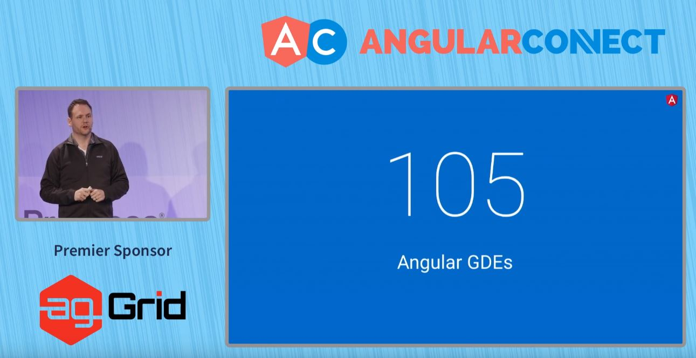
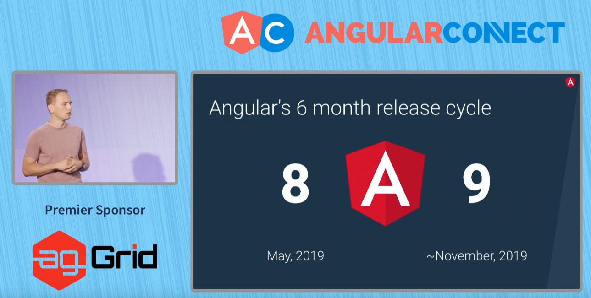

## Recap Keynote Angular Connect Day 1

Hello, I am Jame from Angular Thailand. I am going to summarize the biggest Angular conference in Europe - Angular Connect 2019 Day 1 Keynote.

Let's begin.

Keynote Angular Connect Day 1

Stephen Fluin - Developer Advocate, Angular Team, Google @stephenfluin

Igor Minar Angular Team Lead, Google @IgorMinar

Stephen Fluin introduced it was two years now since Angular 2 was released with ballons on 14 September 2014. 
And now AngularConnect has fifth Anniversary. 🎉🎂 Hooley!

There are 7 new Angular conferences has been organized around the world. The my nearest Angular conference is NG-MY (Malaysia). I was a speaker.

ngGirls is the female Angular Community.
You can check the link. [http://ng-girls.org/](http://ng-girls.org/)

Now, it's a community turn to share the case studies. The first case study was Deutsche Bank.

Rene Kriest - Head of Development for Public Websites

Florian Kittel - Lead Developer for Public Websites

Deutsche Bank has 60 apps to maintain. They have their business components and web editor using drag & drop in order to create the website. There are live preview, one-click deployment, and versioning with their tools.

It was made by Angular with CLI, Schematics to scaffold files, Workspace to manage themes, and NodeJS.

It's Alianz turn.

Jochen Supper 

It was two years now that they create the Alianz UI Library.
They have learned something from adopting Schematics.

1. Steep Learning Curve
To adopt ng update command with library, they need to understand Abstract Syntax Tree (AST)
2. Even though they have Schematics for ng update, some teams still did update manually. Therefore, they need to notify and teach about ng update.
3. For teams that using ng update command, they are happy.

Next story is about two different text input with two use cases.
1. Text Input for B2C Customer with Float Label Animation (Left)

2. Text Input for Employee, Staffs (Expert) without Animation (Right)

It use different markups, so they have to write different conventions in documents.

Developer teams have to read carefully. Some didn't. How to fix this?

The answer is Injection Token to configure input type.
In another words, using code to configure instead of follow document convention.

The solution is to let the team that is responsible for making employee apps import NxExpertModule.

To summarize, Alianz has been transforme
- Manual Update to Automate with Schematics (ng update, ng add)
- Configure by Convention to Configure by Code

NativeScript (Building Cross-platform mobile app with Native UI)
by Stanimira Vlaeva

Recently, there was NativeScript Hackathon making app for NGO.

[Read more](http://ng-ns.org)

Ionic (Bulding Cross-platfor App with WebView)
Mike Harington

Long time ago Ionic team has create their own tools (CLI), Router, and best practices.
However, they have realized it was the heavy investment. Until Ionic 4 released, they have used Angular ways.
For example, they use @angular/cli, @angular/router instead of @ionic/app-scripts, Ionic Router. They also follow Angular Best Practices. In addition, they have extended Angular such as extending Angular Router to be IonRouterOutlet with page transition animation, extend Angular CLI for provide additional information to build iOS & Android, and extending schematics to overrdie default command - ng generate page.

Capacitor - New Cordova

Angular has announced Angular for Designer tool - UI Bakery. [https://uibakery.io/](https://uibakery.io/)

Last year, There were 600+ Angular projects in Google.

Now, there are 1500+ Angular projects.

Firebase and Google Cloud Platform also use Angular.

There are 105 Angular GDE around the world.

Angular has openned Angular Collaborators program to contribute Angular Github Repo.
Jia Li maintains zone.js และ Joost maintains compiler, ngcc Thanks to all collaborators. 🙏

Next stories will be technical updates from Igor Minar.

TODO:
Release Cycle ปกติแล้ว Angular จะมีการอัพเดท Major Version ทุก 6 เดือน นอกจากฟีเจอร์ใหม่แล้ว สิ่งที่สัญญาตลอดมาคือ Backward Compatibility เพราะฉันรู้ว่าฉันผิดไปแล้วจาก AngularJS (1) -> Angular (2+) 🤞 และอัพเกรดเวอร์ชั่นที่ง่ายดายราวกับเวทย์มนต์ 🧙 (ng update)
เดือนพฤษภาคมที่ผ่านมาได้ปล่อย Version 8 ไปแล้ว
อีกไม่กี่สัปดาห์เราก็จะเข้าสู่ Version 9 กันในช่วงประมาณพฤศจิกายน โดยต่อไปจะเป็นการแนะนำฟีเจอร์เด็ดๆใน Version 8

Differential Loading คือการที่ Apps ของเราถูก Build เป็น 2 Bundles - Bundles แรกสำหรับ Browser รุ่นใหม่ Polyfill ไม่มาก Bundle เล็ก และ Bundles สองสำหรับ Browser โบราณ ที่ Polyfill จัดเต็มเลยใหญ่กว่า

ซึ่งก่อนจะมี Differential Loading นั้น Angular CLI ทำการ Build เป็น Bundle เดียวโดยที่ polyfill ขึ้นกับ browserlist file หมายความว่าถ้าใช้ Browser สมัยใหม่ก็อาจจะโหลด polyfill ที่ไม่ต้องใช้เพื่อ support Browser เก่าๆ อยู่ดี

หลังจากที่มี Differential Loading เว็บไซต์ angular.io ลดขนาดไป 41 Kb คิดเป็น 10%

สำหรับเว็บไซต์อื่นๆที่อัพเดทเป็นเวอร์ชั่น 8 จากรายงานแจ้งว่าลดไป 7-20%

ประเด็นมันมีอยู่ว่าสมัยก่อนมัน Build 2 รอบสำหรับ Browser รุ่นใหม่ และรุ่นโบราณ ทำให้ Build ช้า (รูปแรก) แต่ได้แก้เป็นการ Downlevel แทนทำให้ Build เร็วขึ้น 45% (รูปที่สอง)

คำสั่ง ng deploy สำหรับ deploy Angular app ไปยัง Host ต่างๆ ไม่ว่าจะเป็น Firebase, Azure, Netlify และ Github Pages โดยก่อนใช้คำสั่งต้อง ng add ก่อน

Redesign หน้าตาของ app หลังจาก ng new ให้สวยงามและมีประโยชน์มากขึ้น

นอกจากนี้ยังมีฟีเจอร์

- ใช้ Lazy Loading ด้วย import() syntax ตาม Standard
- Custom Builders สำหรับปรับปรุงหรือเพิ่ม Step Build เช่นใช้ Webpack ทำอะไรเพิ่มเติม
- Web Worker Bundling
- AngularJS $location support ใช้สำหรับทำ hybrid AngularJS และ Angular โดยใช้ Router ตัวเดียวกัน
- ปรับปรุงการสนับสนุนของ IDE ให้ดีขึ้น
- นอกจาก Tour of heroes แล้ว ตอนนี้ได้เพิ่ม ตัวอย่าง e-commerce เข้าไปสำหรับมือใหม่

Ivy ทำให้ Debug ง่ายขึ้นโดยสามารถเข้า Console ของ Chrome Dev Tools แล้วพิมพ์คำสั่ง ng.getComponent($0) เพื่อเข้าถึง Component และเรียกใช้ Method ใน Component ณ Runtime นั้นได้เลย โหดๆ 👍👍

เวอร์ชั่นล่าสุด v9.0.0-next.6 นั้นมีรายละเอียดใหม่ในเรื่องของ Bundle Size

App ขนาดเล็ก Build แล้วมีขนาดลดลง 30%, ขนาดกลางเพิ่มขึ้น 10%, ขนาดใหญ่ลดลง 40%

Runtime Ivy นั้นใช้ Concept คล้ายๆ Assembly ที่มี Instruction Sets

โดยผมจะยกตัวอย่างใน Ivy Instruction เช่น

- Ivy Instruction ของการเปิดปิด tag จากรูปด้านบน โค๊ดที่เราเขียนคือเปิดปิด tag div คือ elementStart, elementEnd (ตารางฝั่งขวา)
- Ivy Instruction ของการใส่ข้อความ hello ลงใน tag คือ text
- Ivy Instruction ของการทำ Text Interpolotion {{name}} คือ textInterpolate

และอื่นๆอีกมากมาย โดยปกติแล้ว Instruction ทั้งหมดนี้จะถูกใส่เข้าไปใน Runtime ตามฟีเจอร์ที่เราใช้ใน Code อันไหนไม่ได้ใช้ ก็จะไม่ถูกเข้าไปใน Runtime

ต่างจาก View Engine หรือ Render v2 ที่ใช้ Data Structure แปลงตอน Runtime โดยที่
Runtime ต้องมีทุกฟีเจอร์ของ Angular และไม่สามารถ Tree Shake Feature ที่ไม่ได้ใช้ออกไปได้
จะเห็นได้ว่า Ivy นั้นสามารถถอด Feature ที่ไม่ได้ใช้ส่งผลให้ Bundle Size เล็กกว่าได้
ศึกษาเพิ่มเติมได้ที่ Youtube ด้านล่าง



ขณะนี้มี 150 Ivy Instructions คิดว่ายิ่งมีเยอะยิ่งดีเพื่อให้เป็น Unit ที่เล็กที่สุดในการที่ถอดออกไปได้เมื่อไม่ได้ใช้

โดย Ivy จะเป็น Default ใน Angular Version 9

Library ใน npm นั้นส่วนใหญ่ถูก Compile เพื่อ Support View Engine

Ivy มี ngcc (Angular Compatibility Compiler) สำหรับแปลง Library ที่เคยถูก Compile ด้วย View Engine ให้เป็น Ivy Code
[อ่าน Compiler Spec เพิ่มเติมได้ที่นี่](https://github.com/angular/angular/blob/master/packages/compiler/design/architecture.md#ngcc-operation)

Library ที่เป็น Ivy อยู่แล้วก็สามารถใช้ได้เลยไม่ต้อง Compile ซ้ำเพื่อใช้กับ Ivy App
ส่วน Library ที่เป็น View Engine ก็ต้องใช้ ngcc  Compile ก่อน

Version 9 ตอน Build Apps จะเป็น Ivy โดย Default แต่สำหรับ Libraries จะยังคงเป็น View Engine

Version 10 มีแนวโน้มที่ Instruction Sets นั้น Stable เลยเริ่มทำการ Build Library เป็น Ivy เพื่อที่จะทำให้ ngcc มีบทบาทน้อยลง

Version 11 ngcc จะเป็นแค่ backup สำหรับ library เก่าๆที่เป็น View Engine

จากผลการทดสอบ 173 Library ชื่อดังทั้งหมด ปรากฏว่า 85% ใช้ ngcc แล้วเข้ากันได้กับ Ivy
ทุกท่านสามารถดูผลและทดสอบ Library ของท่านได้ที่ Github [https://github.com/angular/ngcc-validation](https://github.com/angular/ngcc-validation)

อย่างไรก็ดี ทุกท่านสามารถเลือกออก (Opt-out) จาก Ivy จนถึง Version 10

ถ้าอยากลอง Ivy ตอนนี้ คำสั่งนี้เลย

`ng update @angular/cli@next @angular/core@next`

ต่อไปจะเป็นการ Demo Feature ที่ Ivy ทำให้เกิดขึ้นได้ อันแรกคือ

Style Merging [https://github.com/matsko/ivy-styling-demo](https://github.com/matsko/ivy-styling-demo)

Component Lazy Loading [https://github.com/IgorMinar/ivy-lazy-load-component](https://github.com/IgorMinar/ivy-lazy-load-component) ซึ่งนำไปสู่ Progressive Rehydration ศึกษาต่อได้ที่วีดีโอด้านล่าง



สุดท้ายแล้ว เกิด Ecosystem ใหม่สำหรับ

- ng add เพื่อ Add Library
- ng update อัพเดท Apps และ Library
- builders มีคนทำ Custom Builders ใหม่ๆ เช่น ngx-build-plus

จบแล้ว เป็นไงกันบ้างสำหรับการอัพเดทครั้งนี้ ฝากแชร์ต่อให้เพื่อนพี่น้อง ชาว Angular ได้อัพเดทกัน

แล้วเจอกันบทความหน้า สวัสดีครับ

 This article uses<a rel="license" href="http://creativecommons.org/licenses/by-nc-sa/4.0/">Attribution-NonCommercial-ShareAlike 4.0 International (CC BY-NC-SA 4.0)</a>.
