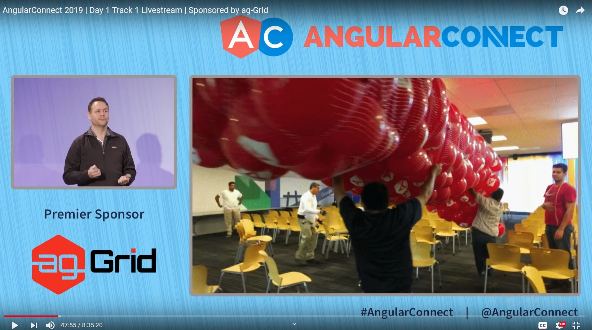
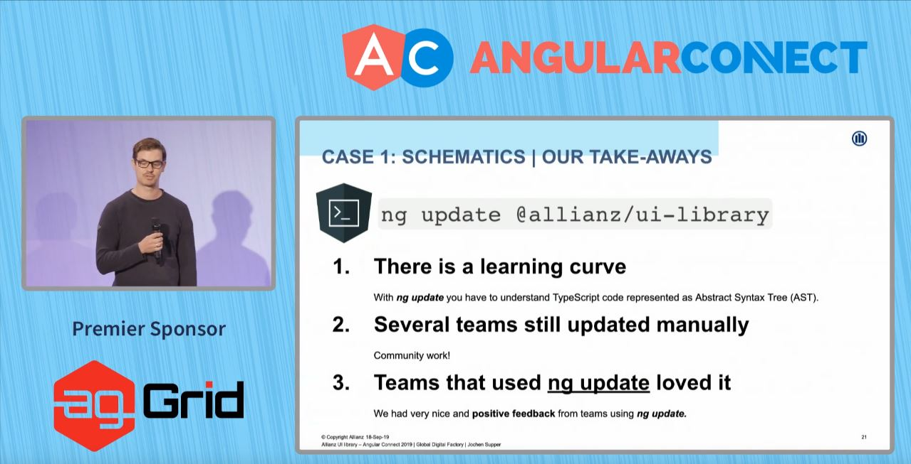

## Recap Keynote Angular Connect Day 1

Hello, I am Jame from Angular Thailand. I am going to summarize the biggest Angular conference in Europe - Angular Connect 2019 Day 1 Keynote.

Let's begin.

Keynote Angular Connect Day 1

Stephen Fluin - Developer Advocate, Angular Team, Google @stephenfluin

Igor Minar Angular Team Lead, Google @IgorMinar

Stephen Fluin introduced it was two years now since Angular 2 was released with ballons on 14 September 2014. 
And now AngularConnect has fifth Anniversary. 🎉🎂 Hooley!

There are 7 new Angular conferences being organized around the world. The my nearest Angular conference is NG-MY (Malaysia 🇲🇾). I was a first time speaker there.  🎤

ngGirls is the female Angular Community. 💃
You can check the link. [http://ng-girls.org/](http://ng-girls.org/)

Now, it's a community turn to share their case studies. The first case study was Deutsche Bank.

Rene Kriest - Head of Development for Public Websites

Florian Kittel - Lead Developer for Public Websites

Deutsche Bank has 60 apps to maintain. They have their business components and web editor using drag & drop in order to create the website. There are live preview, one-click deployment, and versioning with their tools.

It was made by Angular with CLI, Schematics to scaffold files, Workspace to manage themes, and NodeJS.

It's time for Alianz.

Jochen Supper 

It was two years now that they create the Alianz UI Library.
They have learned something from adopting Schematics.

1. Steep Learning Curve - To adopt ng update command with library, they need to understand Abstract Syntax Tree (AST)
2. Even though they have Schematics for ng update, some teams still did update manually. Therefore, they need to notify and teach about ng update.
3. For teams that using ng update command, they are happy.

Next story is about two different text inputs with two use cases.

1. Text Input for B2C customers with float label animation (left)

2. Text Input for employees, staffs (experts) without animation (Right)

It use different markups, so they have to write different conventions in documents.

Developer teams have to read carefully. Some didn't. How to fix this?

The answer is Injection Token to configure input type.
In another words, using code to configure instead of follow document convention.

The solution is to let the team that is responsible for making employee apps import NxExpertModule.

To summarize, Alianz has been transformed from

- Manual Update to Automate with Schematics (ng update, ng add)
- Configure by Convention to Configure by Code

NativeScript (Building Cross-platform mobile app with Native UI)

by Stanimira Vlaeva

Recently, there was NativeScript Hackathon making app for NGO.

[Read more](http://ng-ns.org)

Ionic (Bulding Cross-platfor App with WebView)
Mike Harington

Long time ago, Ionic team has create their own tools (CLI), Router, and best practices.

However, they have realized it was the too much investment. Until Ionic 4 released, they have used Angular ways.

For example, they use @angular/cli, @angular/router instead of @ionic/app-scripts, Ionic Router. 

They also follow Angular Best Practices. In addition, they have extended Angular such as 

1. Extending Angular Router to be IonRouterOutlet with page transition animation
2. Extend Angular CLI for provide additional information to build iOS & Android
3. Extending schematics to overrdie default command - ng generate page

Capacitor - New Cordova

Angular has announced Angular for Designer tool - UI Bakery. [https://uibakery.io/](https://uibakery.io/)

Last year, there were 600+ Angular projects in Google.

Now, there are 1500+ Angular projects.

Firebase and Google Cloud Platform also use Angular.

There are 105 Angular GDEs around the world.

Angular has opened Angular Collaborators program.

- Jia Li maintains zone.js 
- Joost maintains compiler ngcc
- and so many cool collaborators

Thanks to all collaborators. 🙏

Next stories will be technical updates from Igor Minar.

The major release cycle of Angular is every 6 months.
Last majaor release was on May for version 8. 

The upcomming release is in November for version 9.

Let's talk about new feature so far.

Differential Loading is building apps with two bundles.

- Modern browsers with less polyfills
- Legacy browsers with several polyfills.

With differential loading, angular.io size has been decreased 41 Kb (10%)

For most of the webs with Angular 8, the size has been decreased for 7 - 20%.

Building two times is slow, therefore, in CLI 8.3, CLI builds once but using downlevel instead. We get 45% faster.

ng deploy is to deploy Angular app to various hosts such as Firebase, Azure, Netlify, and Github Pages.

The Angular hello world app by ng new has been redesigned. It looks cool! 😎

There are more features in Angular 8.

- Lazy loading with import() syntax to following web standard
- Custom Builders for customize build steps
- Web Worker Bundling
- AngularJS $location support to do hybrid AngularJS and Angular with same router
- Better IDE support
- New tutorial - Tour of heros and E-commerce for beginners

Ivy makes debugging easier by using Console Tab in Chrome Dev Tools with `ng.getComponent($0)` command to access Component directly and call methods during runtime. Awesome 👍👍

With Angular v9.0.0-next.6, the small, medium, large app sizes are  -30%, +10%, -40% respectively.

Ivy runtime uses the Assembly concept that has instruction sets.

There are many Ivy Instructions. e.g.

- Ivy Instruction opening and ending tag - elementStart, elementEnd
- Ivy Instruction adds hello text into tag - text
- Ivy Instruction for text interpolotion {{name}} - textInterpolate

Each feature and each instruction that we use are included in runtime. If not, it will be not included.

View Enginer or Render v2 uses data structures converting during runtime, so the runtime needs all features, and impossible to tree shake those features that we don't use it.

Ivy can tree-shake the unused features, thus, the bundle size is smaller.

You can learn more in this Youtube video.



There are 150 ivy instructions.
More Ivy instructions, more tree-shaking unused features.

Ivy will be default in Angular Version 9

The majority of libraries in npm ecosystem are compiled to support View Engine.

Ivy has ngcc (Angular Compatibility Compiler) to convert View Engine libraries to Ivy code.
[Read more about ngcc spec](https://github.com/angular/angular/blob/master/packages/compiler/design/architecture.md#ngcc-operation)

Libraries compiled by Ivy work fine with Ivy apps.
For View Engine libraries, they need to be recompiled with ngcc. 

In version 9, building apps are Ivy by default but building libraries are still View Engine.

In Version 10, the instruction sets tend to be stable.
Building libraries will be Ivy to use ngcc less.

In Version 11 ngcc will be just a backup for legacy libraries that still use View Engine.

The report told that 85% of 173 well-known libraries are compatible with Ivy.

You can see the result in Github. [https://github.com/angular/ngcc-validation](https://github.com/angular/ngcc-validation)

Everyone can opt-out Ivy until Version 10.

If you want to try Ivy, use this command.

`ng update @angular/cli@next @angular/core@next`

Ivy has enabled a lot of new features.

- Style Merging [https://github.com/matsko/ivy-styling-demo](https://github.com/matsko/ivy-styling-demo)

- Component Lazy Loading [https://github.com/IgorMinar/ivy-lazy-load-component](https://github.com/IgorMinar/ivy-lazy-load-component) leading to Progressive Rehydration

Learn more about Progressive Rehydration by Youtube below.



Finally, there are new ecosystems.

- ng add for adding libraries
- ng update for updating apps and libraries
- Custom Builders such as ngx-build-plus

End. What do you think about new updates from Angular?

Please share this blog for other Angular members.

See you next article. Bye. 👋

 This article uses<a rel="license" href="http://creativecommons.org/licenses/by-nc-sa/4.0/"> Attribution-NonCommercial-ShareAlike 4.0 International (CC BY-NC-SA 4.0)</a>.
