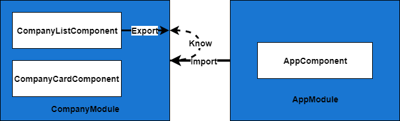
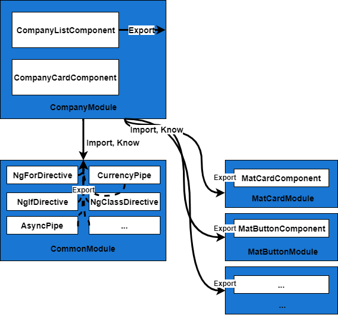
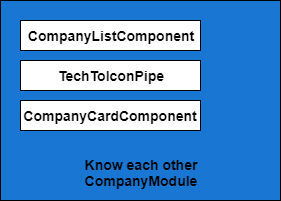

## What's NgModule

Welcome to Angular Fundamental Series 📚

The story behind this blog is that I saw the Chrome Dev Tools 🛠️error in my coworker screen. The error is

```typescript
Error: Template parse errors:
'mat-tab' is not a known element:
1. If 'mat-tab' is an Angular component, then verify that it is part of this module.
2. If 'mat-tab' is a Web Component then add 'CUSTOM_ELEMENTS_SCHEMA' to the '@NgModule.schemas' of this component to suppress this message.
```

Did you forget to import MatTableModule into the feature module that you are developing?
I said.

After she checked, and she found that she didn't import it. She then fixed it, and it works fine.

I keep this problem in my mind, and ask to my ex-coworker who often use Angular.
"Do you really understand what **NgModule** is?"

He replyed "I don't really understand what **NgModule** is. I just know how to make it work." 😱

Thus, I started this blog to clarify **NgModule**.

Let's start.

## NgModule - Unit of Compilation & Distribution

NgModule is JavaScript Class enhanced behaviors with decorator namely  
**@NgModule**. 
**@NgModule** receives metadata object.

```typescript
import { BrowserModule } from '@angular/platform-browser';
import { NgModule } from '@angular/core';
import { AppComponent } from './app.component';

// @NgModule decorator with metadata object (declarations, imports, ...)
@NgModule({
  declarations: [AppComponent],
  imports: [BrowserModule],
  providers: [],
  bootstrap: [AppComponent]
})
export class AppModule {}
```

What does **NgModule** do?
NgModule receives metadata for

1. Tell Angular Compiler how to compile Components, Templates, Directives, Pipes.
2. Define Components, Directives, Pipes to be public via metadata that is **exports** in order to let other modules access and exploit it.
3. Add Services or Providers for Dependency Injection in Component.

Let's see case 1,2 via the below example.

```typescript
@NgModule({
  imports: [
    CommonModule,
    FlexLayoutModule,
    BrowserAnimationsModule,
    MatCardModule,
    MatButtonModule,
    MatIconModule,
    MatProgressSpinnerModule,
  ],
  declarations: [
    CompanyCardComponent,
    TechToIconPipe,
    CompanyListComponent
  ],
  exports: [
    CompanyListComponent,
  ]
})
export class CompanyModule { }
```

[CompanyModule's full code](https://github.com/AngularThailand/who-use-angular-in-thailand/blob/master/apps/who-use-angular-in-thailand/src/app/company/company.module.ts)

There are interesting metadatas - imports, declarations, exports.

However, the order will be exports, imports, and declarations respectively.

</br></br>
**exports**

Define Components, Directives, Pipes to be exported in scope that import this module.

For example, ModuleA import ModuleB, then everything being exported in ModuleB will be in scope of compilation of ModuleA

Therefore, ModuleA can used exported Components, Directives, and Pipes in ModuleB.

The below example shows **CompanyListComponent** is exported in **CompanyModule**

```typescript
@NgModule({
  ...,
  exports: [
    CompanyListComponent,
    // XXXPipe,
    // XXXDirective
  ]
})
export class CompanyModule { }
```

Then, **AppModule** import **CompanyModule**.

```typescript
@NgModule({
  declarations: [
    AppComponent
  ]
  imports: [
    ...,
    CompanyModule,
    ...
  ],
  ...
})
export class AppModule { }
```

[AppModule's full code](https://github.com/AngularThailand/who-use-angular-in-thailand/blob/master/apps/who-use-angular-in-thailand/src/app/app.module.ts)

**AppComponent** inside declarations understands **CompanyListComponent**. and it is able to use **CompanyListComponent** in its template.



Here is the example of **AppComponent** Template (app.component.html) uses `<angular-th-company-list></angular-th-company-list>` that is selector in **CompanyListComponent**.

```html
...
<angular-th-company-list [companies]="companies$ | async" [loaded]="loaded"></angular-th-company-list>
...
```

[app.component.html's full code](https://github.com/AngularThailand/who-use-angular-in-thailand/blob/master/apps/who-use-angular-in-thailand/src/app/app.component.html)

</br></br></br>
**imports**

imports other modules, then all Components, Pipes, Directives in that module will in the scope at Compile-time.

Providers registered in that Module can be used also at Run-time (Dependency Injection).

```typescript
@NgModule({
  imports: [
    CommonModule,
    FlexLayoutModule,
    BrowserAnimationsModule,
    MatCardModule,
    MatButtonModule,
    MatIconModule,
    MatProgressSpinnerModule,
    // XXXModule
  ],
  ...
})
export class CompanyModule { }
```

From above example.
**CompanyCardComponent** (company-card.component.html) uses `<mat-card></mat-card>`
and Directive fxLayoutAlign `<div fxLayoutAlign="center center">`

```html
<mat-card fxLayout="column" *ngIf="company">
  ...
  <div fxLayoutAlign="center center" style="height: 300px">
    ...
  </div>
  ...
</mat-card>
```

[company-card.component.html's full code](https://github.com/AngularThailand/who-use-angular-in-thailand/blob/master/apps/who-use-angular-in-thailand/src/app/company/company-card/company-card.component.html#L1)

To use mat-card (Component) and fxLayoutAlign (Directive), we have to tell Angular Compiler that we are going to use **MatCardComponent**, **FxLayoutAlignDirective**.
In **MatCardModule** and **FxLayoutModule** have already exported it.
Thus, we just imports **MatCardModule** and **FlexLayoutModule** to use it.

How's about **CommonModule**? What does it actually do?
**CommonModule** is important.
**CommonModule** exports `*ngIf, *ngFor, [ngClass], AsyncPipe (| async), CurrencyPipe (| currency)` that why we can use all of it.

[Read more about CommonModule](https://angular.io/api/common/CommonModule)

Other components such as **MatButton, BrowserAnimationsModule, MatIcon, MatProgressBar** has the same concept.

In order to use Angular form, **FormsModule**, or **ReactiveFormsModule** has to be imported also.


</br></br></br>
**declarations**

Define all Component, Directive, Pipe to tell Angular Compiler that we are going to use it. **In this module scope only**

```typescript
@NgModule({
  ...
  declarations: [
    CompanyCardComponent,
    TechToIconPipe,
    CompanyListComponent,
    // XXXDirective
  ],
  ...
})
export class CompanyModule { }
```

From the above example,

Component (**CompanyCardComponent, CompanyListComponent**) and Pipes (**TechToIconPipe**) 
know each other because they are in the same compilation scope. Hence, they can use the others interchangably.

**CompanyCardComponent** uses **TechToIconPipe** in the template.

```html
...

...
```

[company-card.component.html's full code](https://github.com/AngularThailand/who-use-angular-in-thailand/blob/master/apps/who-use-angular-in-thailand/src/app/company/company-card/company-card.component.html#L24)

**CompanyListComponent** loops to create `<angular-th-company-card></angular-th-company-card>` via `*ngFor` in the template.

```html
...
<angular-th-company-card *ngFor="let company of companies" [company]="company"></angular-th-company-card>
...
```

[company-list.component.html's full code](https://github.com/AngularThailand/who-use-angular-in-thailand/blob/master/apps/who-use-angular-in-thailand/src/app/company/company-list/company-list.component.html#L3)



</br></br></br>
**providers**

After Angular Version 6.0, we can create Singleton Service by defining `providedIn: 'root'` in metadata of `@Injectable()` to tell Angular registering Service into Application Root. This process make compiler be able to Tree-shaking unused services.

```typescript
@Injectable({
  providedIn: 'root'
})
export class CompanyService {

  constructor(private http: HttpClient) { }
  getCompanies() {
    return this.http.get<Company[]>('/assets/data/companies.json').pipe(
      shareReplay(1));
  }
}
```

Before Version 6.0, we registers services at module or component level.

```typescript
@NgModule({
  ...
  providers: [
    CompanyService,
    // {
    //   provide: HTTP_INTERCEPTORS, useClass: HttpInterceptorService, multi: true
    // },
  ],
  ...
})
```

**forRoot, forChild, forFeature, forXXX, xxx is ModulewithProviders**

Everyone may notice forRoot, forChild, forFeature, and so on. What is it? 🤔

```typescript
@NgModule({
  imports: [RouterModule.forRoot(...)],
  exports: [RouterModule]
})
export class AppRoutingModule {}

@NgModule({
  imports: [RouterModule.forChild(...)],
  exports: [RouterModule]
})
export class CompanyRoutingModule { }

@NgModule({
  imports: [
    StoreModule.forFeature(...),
    TranslateModule.forChild(...),
    EffectsModule.forFeature(...)
  ],
})
export class ExamplesModule { }

@NgModule({
  imports: [
    AngularFireModule.initializeApp(...),
    StoreModule.forRoot(...),
    StoreRouterConnectingModule.forRoot(),
    EffectsModule.forRoot(...),
    StoreDevtoolsModule.instrument(...),
    TranslateModule.forRoot(...)
  ],
})
export class AppModule { }
```

It seems like to configure something. Right? Let's check the example via AngularFireModule 🔥.

```typescript
@NgModule({
  imports: [
    AngularFireModule.initializeApp({
      apiKey: 'perjerzKey',
      authDomain: 'perjerz.app',
      projectId: 'perjerzId',
      databaseURL: 'https://perjerz.firebaseio.com',
      storageBucket: 'perjerz.appspot.com',
      messagingSenderId: '1212312121',
      appId: '1150',
    }),
    ...
  ],
})
export class AppModule { }
```


Yes, it was used to configure. ✅ We can configure value in tokens and services to use Dependency Injection in component. Component will be able to use that values.

Let's see the example via Setup AngularFire. Angular 🅰️ App want to talk to Firebase 🔥 Therefore, we have to configure where is the our Firebase.

The code below is AngularFireModule code from @angular/fire. It passes parameters to config providers - FirebaseOptionsToken and FirebaseNameOrConfigToken.

```typescript
const FirebaseAppProvider = {
    provide: FirebaseApp,
    useFactory: _firebaseAppFactory,
    deps: [
        FirebaseOptionsToken,
        [new Optional(), FirebaseNameOrConfigToken]
    ]
};

@NgModule({
    providers: [ FirebaseAppProvider ],
})
export class AngularFireModule {
    static initializeApp(options: FirebaseOptions, nameOrConfig?: string | FirebaseAppConfig) { // Pass options, nameOrConfig values here <----
        return {
            ngModule: AngularFireModule,
            providers: [
                { provide: FirebaseOptionsToken, useValue: options },
                { provide: FirebaseNameOrConfigToken, useValue: nameOrConfig }
            ]
        }
    }
}
```

[AngularFireModule's full code](https://github.com/angular/angularfire2/blob/master/src/core/firebase.app.module.ts#L58)\

When we use Firebase services such as AngularFireDatabase, AngularFireAuth, we can use it directly without specifing apiKey, authDomain, and databaseURL every times. It has already resolved values from tokens that we configure (register) in the module.

```typescript
@Injectable()
export class AppGuard implements CanActivate {
  constructor(
    private db: AngularFireDatabase,
    private auth: AngularFireAuth,
    private router: Router,
  ) { }
   canActivate(): Observable<boolean | UrlTree> {
    return this.auth.authState.pipe(switchMap(user => {
        return this.db.object(`...`).valueChanges().pipe(...)
      }
   }
}
```

In addition, newcomers are able to read configuration at the module easily.

[Read more about Dependency Injection at angular.io](https://angular.io/guide/dependency-injection)

</br></br></br>
**entryComponents**

Define components to tell Angular Compiler that we are going to use these components explicitly for creating component factories, dynamic loading at Run-time (imperatively). Please don't tree Shake these components out.

For components that we use in the template `<angular-th-company-card></angular-th-company-card>`, Angular compiler understand how it be used because of referenceing. Angular compiler is then able to inline instantiation. (Statically, Declaratively)

However [Dynamic Component Loader](https://angular.io/guide/dynamic-component-loader) (Load Component in Runtime) needs entryComponents.

The clear example is [MatDialog](https://material.angular.io/components/dialog/overview#configuring-dialog-content-via-code-entrycomponents-code-) (Material Dialog). We have to explicitly define MatDialog component in order to open the dialog.

```typescript
@NgModule({
  imports: [
    // ...
    MatDialogModule
  ],

  declarations: [
    AppComponent,
    ExampleDialogComponent
  ],

  entryComponents: [
    ExampleDialogComponent // Must add this Component, however for Ivy, it is not neccessary anymore
  ],

  providers: [],
  bootstrap: [AppComponent]
})
export class AppModule {}
```

Another example is loading Component in Routes (RouterModule). It uses component factory also because of dynamic loading at runtime. However, we don't have to define components in entryComponents becuase RouterModule do it for us during compilation.

```typescript
const routes: Routes = [
  {
    path: 'a',
    component: ComponentA
  },
  {
    path: 'b',
    component: ComponentB
  }
];

@NgModule({
  imports: [
    RouterModule.forRoot(routes)
  ],
  exports: [RouterModule],
})
export class AppRoutingModule {}
```

**However, we don't need entryComponents anymore in Ivy. Check below link**

[refactor(core): deprecate entryComponents #33205](https://github.com/angular/angular/pull/33205)

The another interesting story is when we declare and export ComponentA, ComponentB, and Component C in ModuleA, then we import ModuleA into AppModule. However, we don't use or reference it in templates or controllers. The Angular Compiler will not include these components in the bundle. For example, we use CustomMatModule that declares and exports MatButton and MatCard. Even though we import this CustomMatModule, we don't need to pay bundle size's cost if we don't reference or use them in the template or controllers.

**However, my best practice is that I do always import what I actually needs. It will be difficult to know what dependencies we are using when project is complicated.**

```typescript
@NgModule({
  imports: [
    MatButtonModule,
    MatCardModule,
    ...
  ],
  exports: [
    MatButtonModule,
    MatCardModule,
    ...
  ], // Even though these are exported, we don't have to pay if we not using it
  declarations: []
})
export class CustomMatModule { }
```

</br></br></br>
**bootstrap**

Define Component to start the App (Bootstrap) - Root Component or AppComponent
Bootstrap Component will be automatically added into entryComponents.

Here is the example in AppModule.

```typescript
@NgModule({
  declarations: [AppComponent],
  imports: [BrowserModule],
  providers: [],
  bootstrap: [AppComponent]
})
export class AppModule {}
```

</br></br></br>
**schemas**

Define Schema to allow compilation scope in NgModule. There are two values - [NO_ERRORS_SCHEMA](https://github.com/angular/angular/blob/master/packages/core/src/metadata/schema.ts#L38) and [CUSTOM_ELEMENTS_SCHEMA](https://github.com/angular/angular/blob/master/packages/core/src/metadata/schema.ts#L29).

**NO_ERRORS_SCHEMA - Tell Angular Compiler to allow all elements and properties**

For [Shallow Testing](https://vsavkin.com/three-ways-to-test-angular-2-components-dcea8e90bd8d) we want to test Angular Template by ignoring dependencies of components (Don't care template errors about what dependencies they need)

We can configure module to make Angular components behaving as simple DOMs.

The below example is that the component - ConversationsCmp to be shallow testing.
We just want to test that it renders texts correctly. However, the parent of texts is  `<mat-card></mat-card>` or MatCardComponent. We don't really care it. We just want to check there is right text inside.

When we create TestBed, we have to configure the module with schemas `NO_ERRORS_SCHEMA` to ignore the error from not importing `MatCardModule`. Angular Compiler will be clear about the scope of `MatCardComponent` and the test is passed.

```html
<mat-card *ngFor="let c of conversations | async" [routerLink]="[c.id]">
  <h3>
    <a [routerLink]="[c.id]">{{c.title}}</a>
  </h3>
  <p>
    <span class="light">{{c.user.name}} [{{c.user.email}}]</span>
  </p>
</mat-card>
```

```typescript
@Component({templateUrl: 'conversations.html'})
export class ConversationsCmp {
  folder: Observable<string>;
  conversations: Observable<Conversation[]>;

  constructor(route: ActivatedRoute) {
    this.folder = route.params.pluck<string>('folder');
    this.conversations = route.data.pluck<Conversation[]>('conversations');
  }
}
```

```typescript
describe('ConversationsCmp', () => {
  let params: BehaviorSubject<string>;
  let data: BehaviorSubject<any>;

  beforeEach(async(() => {
    params = of({
      folder: 'inbox'
    });

    data = of({
      conversations: [
        { id: 1, title: 'On the Genealogy of Morals by Nietzsche', user: {name: 'Kate', email: 'katez@example.com'} },
        { id: 2, title: 'Ethics by Spinoza', user: {name: 'Corin', email: 'corin@example.com'} }
      ]
    });

    TestBed.configureTestingModule({
      declarations: [ConversationsCmp],
      providers: [
        { provide: ActivatedRoute, useValue: {params, data} }
      ],
      // Tells the compiler not to error on unknown elements and attributes
      schemas: [NO_ERRORS_SCHEMA]
    });
    TestBed.compileComponents();
  }));

  it('updates the list of conversations', () => {
    const f = TestBed.createComponent(ConversationsCmp);
    f.detectChanges();

    expect(f.debugElement.nativeElement).toHaveText('inbox');
    expect(f.debugElement.nativeElement).toHaveText('On the Genealogy of Morals');
    expect(f.debugElement.nativeElement).toHaveText('Ethics');

    params.next({
      folder: 'drafts'
    });

    data.next({
      conversations: [
        { id: 3, title: 'Fear and Trembling by Kierkegaard', user: {name: 'Someone Else', email: 'someonelse@example.com'} }
      ]
    });
    f.detectChanges();

    expect(f.debugElement.nativeElement).toHaveText('drafts');
    expect(f.debugElement.nativeElement).toHaveText('Fear and Trembling');
  });
});
```

**CUSTOM_ELEMENTS_SCHEMA - Tell Angular Compiler to allow Non-Angular elements and properties with dash case. Dash case is convention of custom elements**

Angular always understands that Custom HTML Tag is Angular Component. When it encounter weird elements that out of scopes, the compiler then throw the error. To use custom elements, we have to enable Angular Compiler compiler to understand custom elements.

```typescript
import { BrowserModule } from '@angular/platform-browser';
import { NgModule, CUSTOM_ELEMENTS_SCHEMA } from '@angular/core';
import { ReactiveFormsModule } from '@angular/forms';

import { AppComponent } from './app.component';

@NgModule({
  declarations: [AppComponent],
  schemas: [CUSTOM_ELEMENTS_SCHEMA] // <-- Here!
  imports: [BrowserModule, ReactiveFormsModule],
  providers: [],
  bootstrap: [AppComponent]
})
export class AppModule {}
```

[Read more about Custom Element in Angular](https://vaadin.com/tutorials/using-web-components-in-angular)

## Summary of NgModule

1. Tell Angular Compiler how to compile Components, Templates, Directives, Pipes
2. Define Components, Directives, Pipes to be public via metadata that is **exports** in order to let other modules access and exploit it.
3. Add Services or Providers for Dependency Injection in Component.

Before ending this blog, I have a quiz ⚡ for you.

Angular App 🅰️ has been splited into feature modules already.

CEO 😎 want Angular App's telephone's input 📞 to have mask from 0999999999 to 099-999-999 **For every telephone's input in the App**

We 👨💻 then search for the libraries in Google, and we found [ngx-mask](https://github.com/JsDaddy/ngx-mask).

We have already installed `npm install --save ngx-mask`.

In ngx-mask github have installation guide by import Module like below.

```typescript
import { NgxMaskModule } from 'ngx-mask'

export const options: Partial<IConfig> | (() => Partial<IConfig>);

@NgModule({
  (...)
  imports: [
    NgxMaskModule.forRoot(options)
  ]
  (...)
})
```

My question is where should import `NgxMaskModule`, and how?

1. import NgxMaskModule.forRoot(options) at AppModule
2. import NgxMaskModule.forRoot(options) at AppModule and all Feature Module
3. import NgxMaskModule.forRoot(options) at AppModule and import NgxMaskModule at Feature Module
4. import NgxMaskModule at AppModule and all Featured Module
5. import NgxMaskModule at AppModule and import NgxMaskModule.forRoot(options) all Feature Module
6. import NgxMaskModule at AppModule

And we will be able to use below codes.

```html
<input type="text" mask="000-000-000">
```

```html
<span>{{phone | mask: '000-000-0000'}}</span>
```

Please share 🔗 this blog for other Angular members.

See you next article 👋. Bye. 🙏

<a rel="license" href="http://creativecommons.org/licenses/by-nc-sa/4.0/"></a><br />This article uses<a rel="license" href="http://creativecommons.org/licenses/by-nc-sa/4.0/"> Attribution-NonCommercial-ShareAlike 4.0 International (CC BY-NC-SA 4.0)</a>.
