## สรุป Keynote Angular Connect วันแรก

สวัสดีครับผมเจมส์จาก Angular Thailand วันนี้ผมจะสรุป Keynote ของงาน Angular Conference ที่ยิ่งใหญ่ใน Europe ที่มีชื่อว่า Angular Connect ให้ทุกท่านได้อ่านกัน มาเริ่มกันเลย

Keynote Angular Connect Day 1

Stephen Fluin - Developer Advocate, Angular Team, Google @stephenfluin

Igor Minar Angular Team Lead, Google @IgorMinar

เปิดทอล์คโดย Stephen Fluin เล่าไปถึงวันเปิดตัว Angular 2 ที่ขนพร็อบบอลลูนจัดเต็ม ย้อนเวลาไป 14 กันยายน 2014 ครบรอบ 5 ปีของ AngularConnect และ 3 ปีนับตั้งแต่วันที่ปล่อย Angular 2 🎉🎂 เย้!
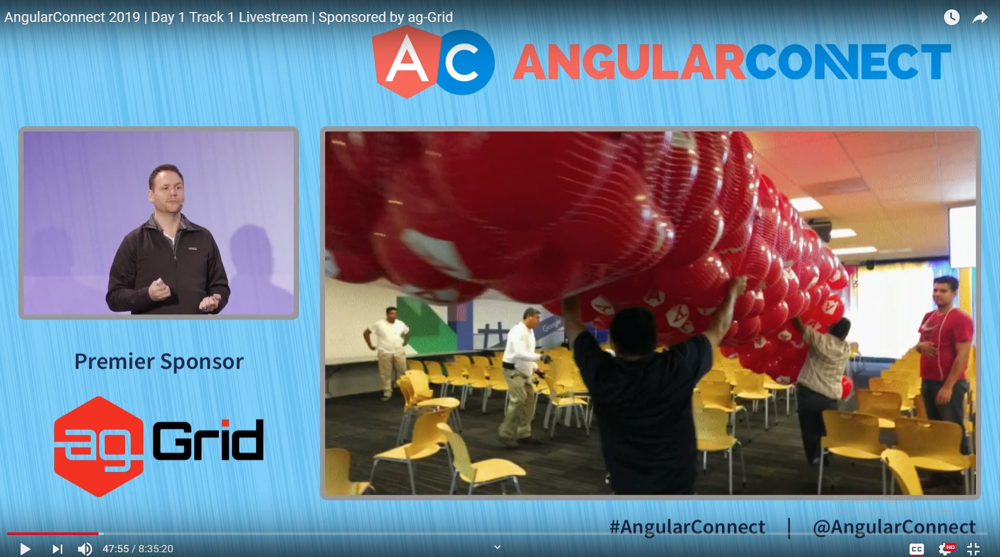

มาต่อด้วย Angular Conference ที่เกิดขึ้นใหม่ทั่วโลกในปีนี้ ปีนี้มีเพิ่มขึ้น 7 Conferences ใกล้ประเทศไทยสุดเป็น NG-MY (Malaysia) ผมเพิ่งไปพูดมา

เป็น Conference ที่เทียบราคากับความรู้ที่ได้รับกับเพื่อน Angular แล้วถือว่าเกินคุ้มมากๆ เจอกันอีกแน่นอน NG-MY 2020 ขอเชิญชวนทุกท่านไปร่วมสนุกกันที่งานครับ

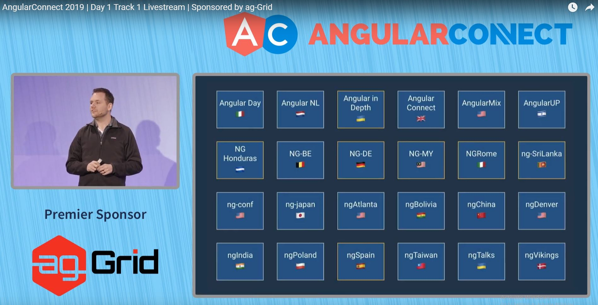

มาช่วยกันยกระดับ Angular Developers เมืองไทยด้วยการ ออกมาเขียนบทความ, จัด Meetup, เป็น Speakers แชร์ประสบการณ์
เพื่อเตรียมตัวสำหรับการจัด Angular Thailand Conference

ngGirls มี Angular Community และมี Workshop สำหรับผู้หญิงโดยเฉพาะ หากท่านสนใจ สามารถอ่านรายละเอียดได้ที่ [http://ng-girls.org/](http://ng-girls.org/)

จากนั้น Stephen แนะนำเรื่องราวจาก Community มาแชร์ Case Study ต่างๆโดยเริ่มต้นที่ Deutsche Bank

Rene Kriest - Head of Development for Public Websites

Florian Kittel - Lead Developer for Public Websites

Deutsche Bank มี 60 Apps สร้าง Business Component และ สร้างเว็บ Editor ที่สามารถสร้างเว็บด้วยการ Drag & Drop 😮 รวมถึงมี Live Preview, One-click Deployment, และ Versioning

ทุกอย่างถูกสร้างด้วย Angular & NodeJS โดยใช้ Angular CLI, Schematics สร้างโค๊ด, Workspace จัดการ Themes
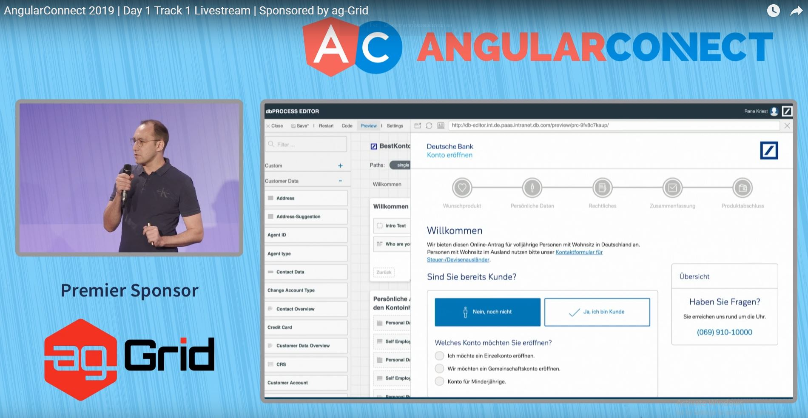

ต่อไปเป็นฝั่งของ Alianz

Jochen Supper ย้อนไปสองปีที่แล้วว่าเป็นจุดเริ่มต้นของการสร้าง UI Library ของ Alianz
และได้รับบทเรียนจากการ Adopt Schematics

1. มี Learning Curve การสร้างคำสั่ง ng update นั้นต้องเข้าใจเรื่อง Abstract Syntax Tree (AST)
2. ถึงแม้ว่าจะมี Schematics สำหรับ ng update แล้ว บางทีมใน Alianz ยังคงอัพเดท Manual จึงจำเป็นที่จะต้องแจ้งทีมและสอนการใช้งาน
3. ส่วนทีมที่ใช้ ng update ก็มีความสุขกันเพราะง่ายและสะดวก

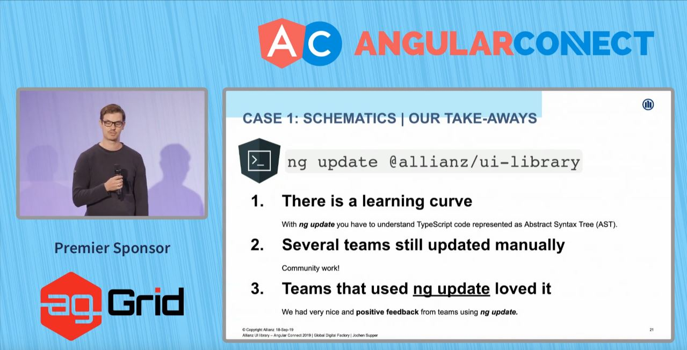

บทเรียนต่อมาคือ Alianz นั้นมี Text Input สองแบบที่ Support คนละ Use case

1. สำหรับลูกค้า (B2C) ที่ใส่ Float Label Animation (ฝั่งซ้าย)
2. สำหรับพนักงานหรือเจ้าหน้าที่ (Expert) ที่ไม่ต้องการ Animation (ฝั่งขวา)

ซึ่งใช้ markup คนละแบบ เลยต้องไปเขียน Convention แต่ละแบบใน Document ให้คนปฏิบัติตาม ทีมนักพัฒนาก็เลยต้องอ่านให้ละเอียด ซึ่งบางคนไม่ได้อ่านละเอียด จะมีวิธีที่ดีกว่านี้ไหม

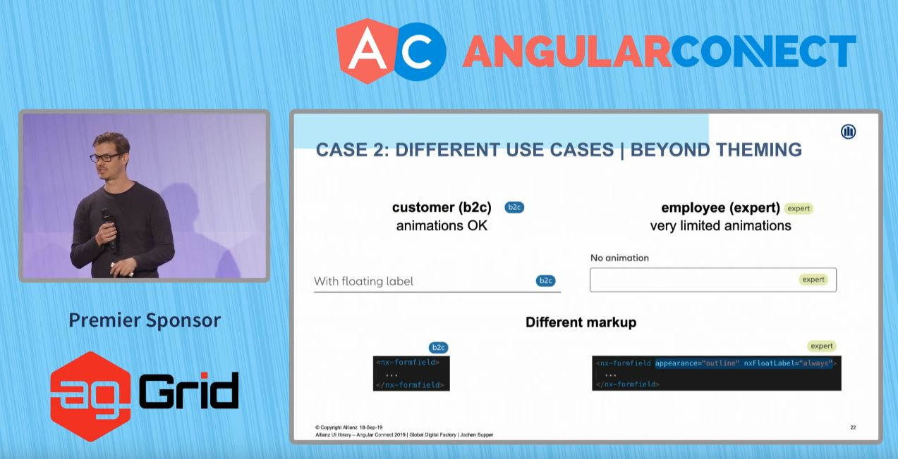

คำตอบคือการใช้ Injection Token ที่มี Config แบบพนักงาน (Expert) กล่าวคือแก้ปัญหาด้วย Code แทนการ Follow ตาม Convention ใน Document

วิธีการง่ายๆคือสำหรับ Team ที่ทำ App ภายในให้พนักงาน ก็แค่ import NxExpertModule ที่มี Config

โดยสรุปแล้วสิ่งที่ Alianz เรียนรู้คือการเปลี่ยนจากการ Manual Update ไปเป็น Schematics (ng update, ng add) และ Convention ด้วย Document ไปเป็น Code แทน

ต่อไปเป็นตาของ NativeScript (สร้าง App Cross-platform แต่ได้ Native UI Concept เดียวกับ React Native)
โดย Stanimira Vlaeva

เมื่อไม่นานมานี้ มี NativeScript Hackathon สร้าง App เพื่อช่วยเหลือ NGO

สามารถอ่านรายละเอียดเพิ่มเติมได้ที่ [https://ng-ns.org](http://ng-ns.org)
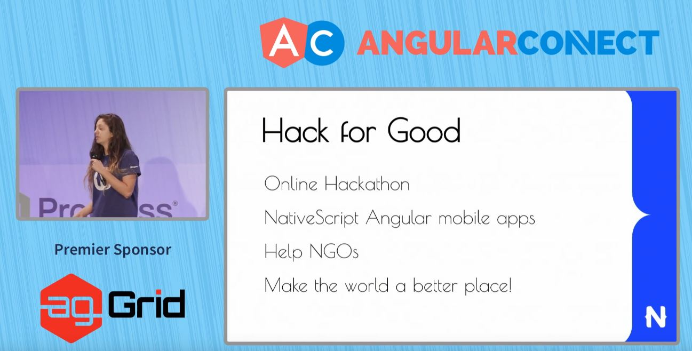

ต่อไปเป็นช่วงของ Ionic ผู้อยู่คู่กับ Angular มานานแสนนาน (สร้าง App Cross-platform ด้วย WebView)
Mike Harington

สมัยก่อนทีม Ionic สร้าง Tools (CLI), Router และ Best Practices ของตัวเอง แต่แล้วก็ตระหนักว่ามันเป็นการลงทุนที่มากเหมือนกัน จนมาถึง Ionic 4 ที่ Adopt ตาม Angular เช่น เปลี่ยนจาก @ionic/app-scripts เป็น @angular/cli, Ionic Router เป็น @angular/router และ ใช้ Best Practice ของ Angular นอกนั้นยังไม่พอ ทีม Ionic ยังต่อยอด Angular Router เป็น IonRouterOutlet ด้วยการเพิ่ม Animation เปลี่ยนหน้า, ต่อยอด Angular CLI เพื่อ Provide ข้อมูลเพิ่มเติมตอน Build ลง iOS, Android และ ต่อยอด Schematics เพื่อ Override คำสั่ง Default เช่น ng generate page
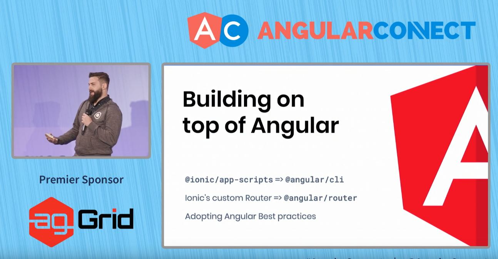

Capacitor ผู้มาแทนที่ Cordova
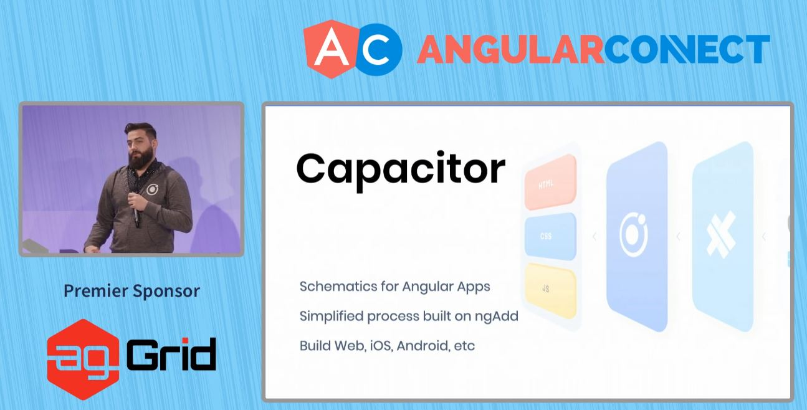

กลับมาที่ Stephen กันต่อ

ยังจำได้ไหมว่า Angular เคยมี Angular for Designer ที่ใช้เครื่องมือออกแบบแล้วสร้างโค๊ด Angular ออกมา มันกลับมาแล้วในชื่อว่า UI Bakery ตามไปลองได้ที่ [https://uibakery.io/](https://uibakery.io/)
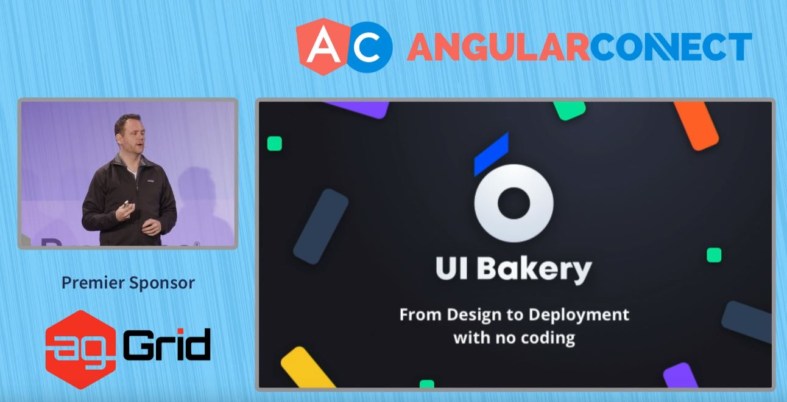

มีรายงานว่าใน Google มี Angular Projects 600+ เมื่อปีที่แล้ว

มาปีนี้มี Angular Project ทั้งหมด 1500+

Firebase, Google Cloud Platform ล้วนใช้ Angular เป็นการการันตีความน่าเชื่อถือของ Angular ได้อย่างมาก

ตอนนี้มี GDE Angular ทั้งหมด 105 คนทั่วโลก ผมนี่รอ GDE Angular คนแรกในไทยเลยว่าจะเป็นใครนะ 🤔🤔
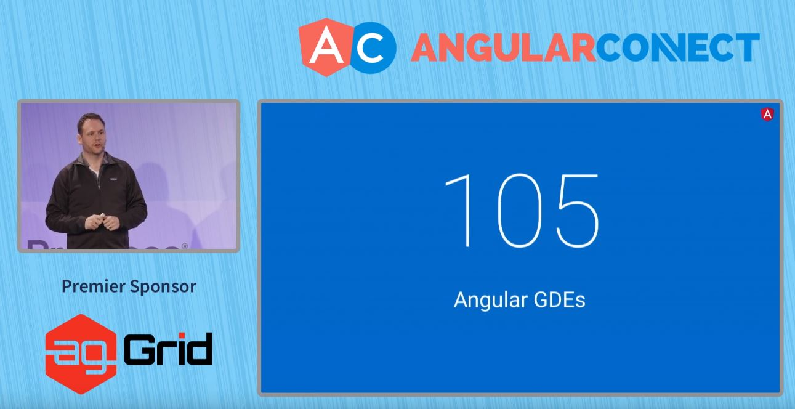

Angular ได้เปิดตัวโปรแกรม Angular Collaborators หรือคนที่ช่วย Contribute Angular Github Repo
โดยมี Jia Li ผู้อยู่เบื้องหลัง zone.js และ Joost ดูเรื่อง compiler, ngcc ขอบคุณ Collaborators ทุกท่าน 🙏
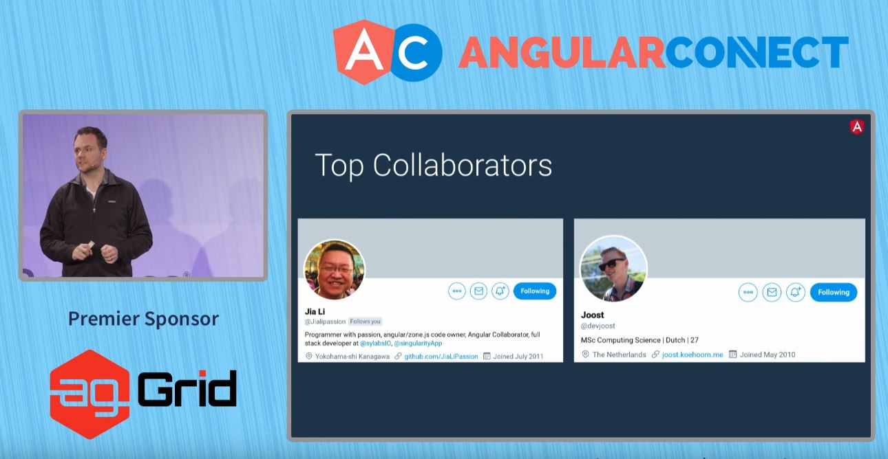

จบแล้วสำหรับฝั่งของ Stephen ถึงเวลาฟังเนื้อหา Technical Update จาก Igor Minar กัน

เรามาทบทวนกันดีกว่าเรื่อง Release Cycle ปกติแล้ว Angular จะมีการอัพเดท Major Version ทุก 6 เดือน นอกจากฟีเจอร์ใหม่แล้ว สิ่งที่สัญญาตลอดมาคือ Backward Compatibility เพราะฉันรู้ว่าฉันผิดไปแล้วจาก AngularJS (1) -> Angular (2+) 🤞 และอัพเกรดเวอร์ชั่นที่ง่ายดายราวกับเวทย์มนต์ 🧙 (ng update)
เดือนพฤษภาคมที่ผ่านมาได้ปล่อย Version 8 ไปแล้ว
อีกไม่กี่สัปดาห์เราก็จะเข้าสู่ Version 9 กันในช่วงประมาณพฤศจิกายน โดยต่อไปจะเป็นการแนะนำฟีเจอร์เด็ดๆใน Version 8
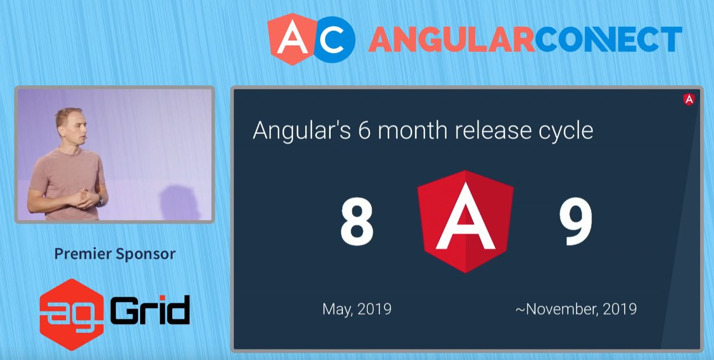

Differential Loading คือการที่ Apps ของเราถูก Build เป็น 2 Bundles - Bundles แรกสำหรับ Browser รุ่นใหม่ Polyfill ไม่มาก Bundle เล็ก และ Bundles สองสำหรับ Browser โบราณ ที่ Polyfill จัดเต็มเลยใหญ่กว่า

ซึ่งก่อนจะมี Differential Loading นั้น Angular CLI ทำการ Build เป็น Bundle เดียวโดยที่ polyfill ขึ้นกับ browserlist file หมายความว่าถ้าใช้ Browser สมัยใหม่ก็อาจจะโหลด polyfill ที่ไม่ต้องใช้เพื่อ support Browser เก่าๆ อยู่ดี

หลังจากที่มี Differential Loading เว็บไซต์ angular.io ลดขนาดไป 41 Kb คิดเป็น 10%

สำหรับเว็บไซต์อื่นๆที่อัพเดทเป็นเวอร์ชั่น 8 จากรายงานแจ้งว่าลดไป 7-20%
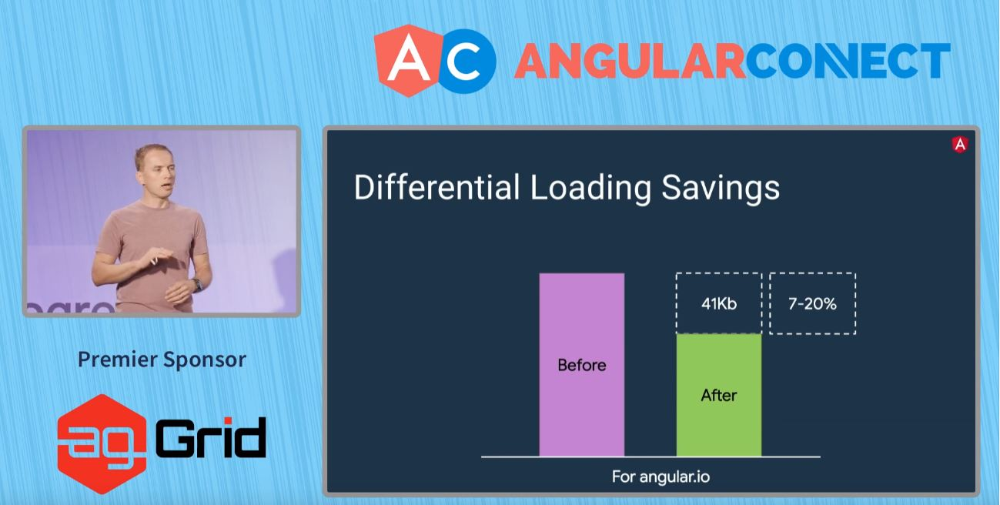

ประเด็นมันมีอยู่ว่าสมัยก่อนมัน Build 2 รอบสำหรับ Browser รุ่นใหม่ และรุ่นโบราณ ทำให้ Build ช้า (รูปแรก) แต่ได้แก้เป็นการ Downlevel แทนทำให้ Build เร็วขึ้น 45% (รูปที่สอง)

คำสั่ง ng deploy สำหรับ deploy Angular app ไปยัง Host ต่างๆ ไม่ว่าจะเป็น Firebase, Azure, Netlify และ Github Pages โดยก่อนใช้คำสั่งต้อง ng add ก่อน
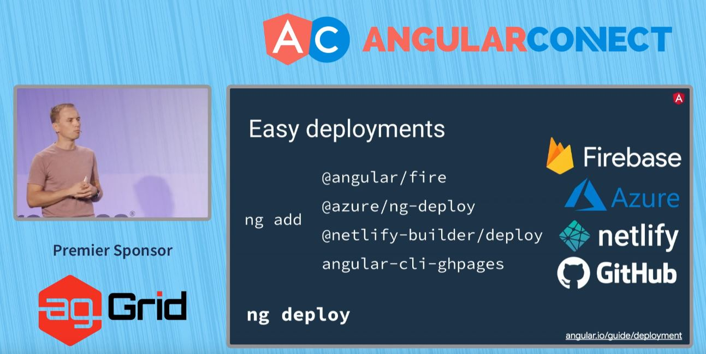

Redesign หน้าตาของ app หลังจาก ng new ให้สวยงามและมีประโยชน์มากขึ้น

นอกจากนี้ยังมีฟีเจอร์

- ใช้ Lazy Loading ด้วย import() syntax ตาม Standard
- Custom Builders สำหรับปรับปรุงหรือเพิ่ม Step Build เช่นใช้ Webpack ทำอะไรเพิ่มเติม
- Web Worker Bundling
- AngularJS $location support ใช้สำหรับทำ hybrid AngularJS และ Angular โดยใช้ Router ตัวเดียวกัน
- ปรับปรุงการสนับสนุนของ IDE ให้ดีขึ้น
- นอกจาก Tour of heroes แล้ว ตอนนี้ได้เพิ่ม ตัวอย่าง e-commerce เข้าไปสำหรับมือใหม่

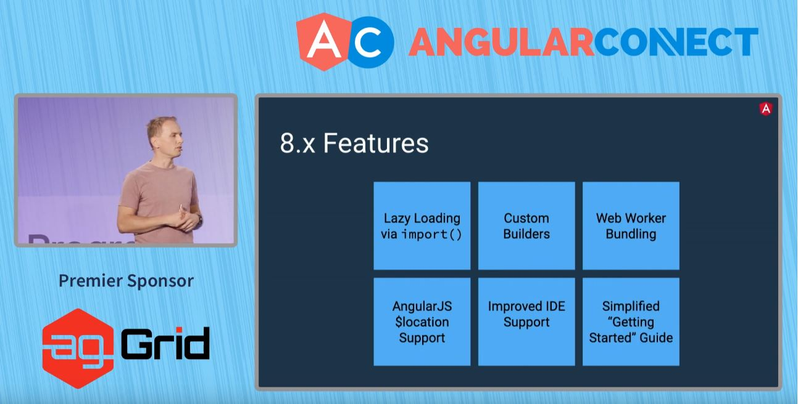

Ivy ทำให้ Debug ง่ายขึ้นโดยสามารถเข้า Console ของ Chrome Dev Tools แล้วพิมพ์คำสั่ง ng.getComponent($0) เพื่อเข้าถึง Component และเรียกใช้ Method ใน Component ณ Runtime นั้นได้เลย โหดๆ 👍👍
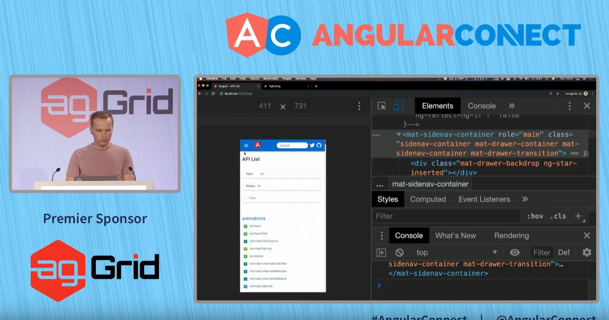

เวอร์ชั่นล่าสุด v9.0.0-next.6 นั้นมีรายละเอียดใหม่ในเรื่องของ Bundle Size

App ขนาดเล็ก Build แล้วมีขนาดลดลง 30%, ขนาดกลางเพิ่มขึ้น 10%, ขนาดใหญ่ลดลง 40%
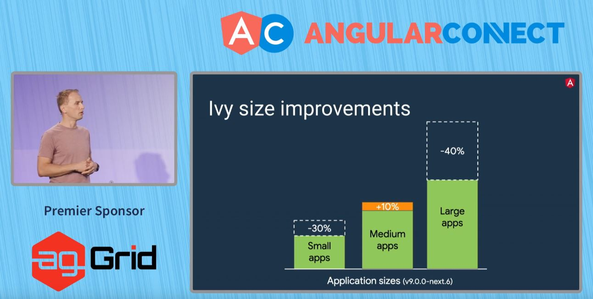

Runtime Ivy นั้นใช้ Concept คล้ายๆ Assembly ที่มี Instruction Sets

โดยผมจะยกตัวอย่างใน Ivy Instruction เช่น

- Ivy Instruction ของการเปิดปิด tag จากรูปด้านบน โค๊ดที่เราเขียนคือเปิดปิด tag div คือ elementStart, elementEnd (ตารางฝั่งขวา)
- Ivy Instruction ของการใส่ข้อความ hello ลงใน tag คือ text
- Ivy Instruction ของการทำ Text Interpolotion {{name}} คือ textInterpolate

และอื่นๆอีกมากมาย โดยปกติแล้ว Instruction ทั้งหมดนี้จะถูกใส่เข้าไปใน Runtime ตามฟีเจอร์ที่เราใช้ใน Code อันไหนไม่ได้ใช้ ก็จะไม่ถูกเข้าไปใน Runtime

ต่างจาก View Engine หรือ Render v2 ที่ใช้ Data Structure แปลงตอน Runtime โดยที่
Runtime ต้องมีทุกฟีเจอร์ของ Angular และไม่สามารถ Tree Shake Feature ที่ไม่ได้ใช้ออกไปได้
จะเห็นได้ว่า Ivy นั้นสามารถถอด Feature ที่ไม่ได้ใช้ส่งผลให้ Bundle Size เล็กกว่าได้
ศึกษาเพิ่มเติมได้ที่ Youtube ด้านล่าง



ขณะนี้มี 150 Ivy Instructions คิดว่ายิ่งมีเยอะยิ่งดีเพื่อให้เป็น Unit ที่เล็กที่สุดในการที่ถอดออกไปได้เมื่อไม่ได้ใช้

โดย Ivy จะเป็น Default ใน Angular Version 9

Library ใน npm นั้นส่วนใหญ่ถูก Compile เพื่อ Support View Engine

Ivy มี ngcc (Angular Compatibility Compiler) สำหรับแปลง Library ที่เคยถูก Compile ด้วย View Engine ให้เป็น Ivy Code
[อ่าน Compiler Spec เพิ่มเติมได้ที่นี่](https://github.com/angular/angular/blob/master/packages/compiler/design/architecture.md#ngcc-operation)

Library ที่เป็น Ivy อยู่แล้วก็สามารถใช้ได้เลยไม่ต้อง Compile ซ้ำเพื่อใช้กับ Ivy App
ส่วน Library ที่เป็น View Engine ก็ต้องใช้ ngcc  Compile ก่อน

Version 9 ตอน Build Apps จะเป็น Ivy โดย Default แต่สำหรับ Libraries จะยังคงเป็น View Engine

Version 10 มีแนวโน้มที่ Instruction Sets นั้น Stable เลยเริ่มทำการ Build Library เป็น Ivy เพื่อที่จะทำให้ ngcc มีบทบาทน้อยลง

Version 11 ngcc จะเป็นแค่ backup สำหรับ library เก่าๆที่เป็น View Engine
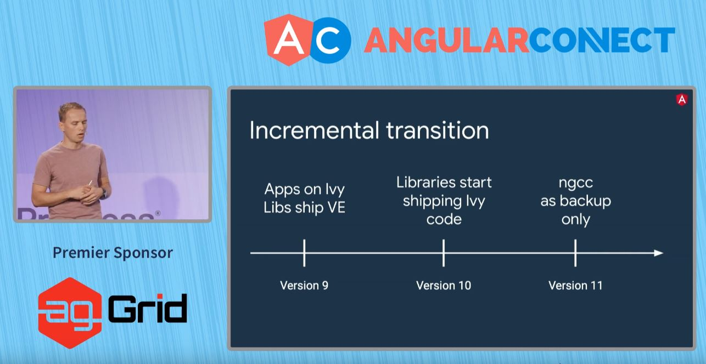

จากผลการทดสอบ 173 Library ชื่อดังทั้งหมด ปรากฏว่า 85% ใช้ ngcc แล้วเข้ากันได้กับ Ivy
ทุกท่านสามารถดูผลและทดสอบ Library ของท่านได้ที่ Github [https://github.com/angular/ngcc-validation](https://github.com/angular/ngcc-validation)
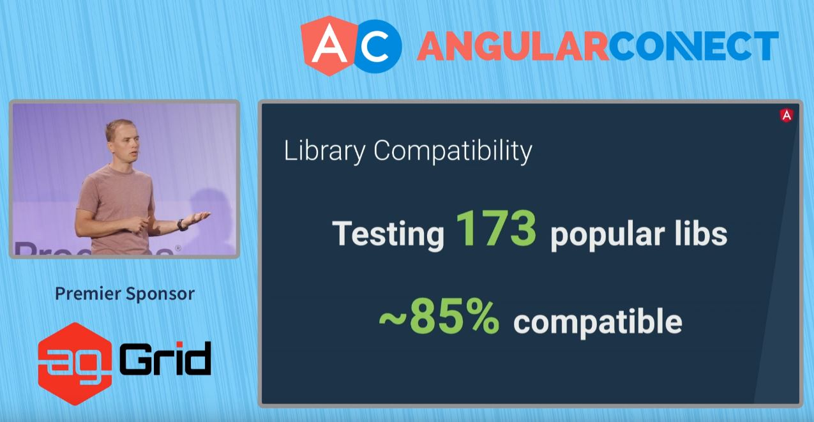

อย่างไรก็ดี ทุกท่านสามารถเลือกออก (Opt-out) จาก Ivy จนถึง Version 10

ถ้าอยากลอง Ivy ตอนนี้ คำสั่งนี้เลย

`ng update @angular/cli@next @angular/core@next`

ต่อไปจะเป็นการ Demo Feature ที่ Ivy ทำให้เกิดขึ้นได้ อันแรกคือ

Style Merging [https://github.com/matsko/ivy-styling-demo](https://github.com/matsko/ivy-styling-demo)

Component Lazy Loading [https://github.com/IgorMinar/ivy-lazy-load-component](https://github.com/IgorMinar/ivy-lazy-load-component) ซึ่งนำไปสู่ Progressive Rehydration ศึกษาต่อได้ที่วีดีโอด้านล่าง



สุดท้ายแล้ว เกิด Ecosystem ใหม่สำหรับ

- ng add เพื่อ Add Library
- ng update อัพเดท Apps และ Library
- builders มีคนทำ Custom Builders ใหม่ๆ เช่น ngx-build-plus

จบแล้ว เป็นไงกันบ้างสำหรับการอัพเดทครั้งนี้ ฝากแชร์ต่อให้เพื่อนพี่น้อง ชาว Angular ได้อัพเดทกัน

แล้วเจอกันบทความหน้า สวัสดีครับ

 บทความนี้ใช้<a rel="license" href="http://creativecommons.org/licenses/by-nc-sa/4.0/">สัญญาอนุญาตของครีเอทีฟคอมมอนส์แบบ แสดงที่มา-ไม่ใช้เพื่อการค้า-อนุญาตแบบเดียวกัน 4.0 International</a>.
