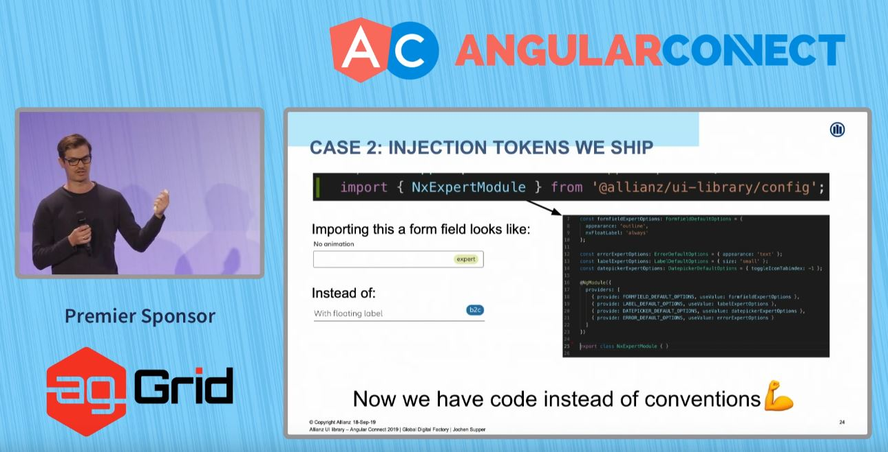
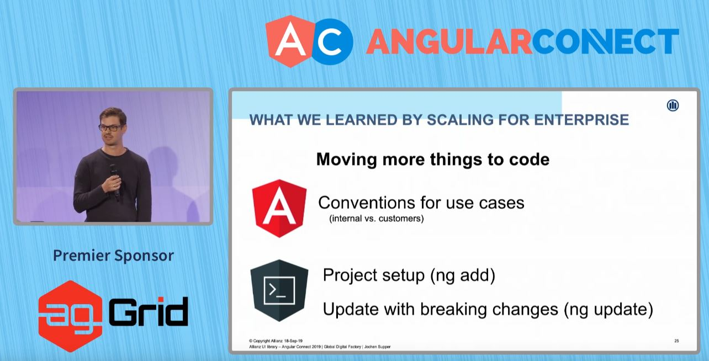

## สรุป Keynote Angular Connect วันแรก

สวัสดีครับผมเจมส์จาก Angular Thailand วันนี้ผมจะสรุป Keynote ของงาน Angular Conference ที่ยิ่งใหญ่และเก่าแก่เกือบที่สุดใน Europe หรือ Angular Connect ให้ทุกท่านได้อ่านกัน มาเริ่มกันเลยดีกว่า

Keynote Angular Connect Day 1

Stephen Fluin - Developer Advocate, Angular Team, Google @stephenfluin

Igor Minar Angular Team Lead, Google @IgorMinar

เปิดทอล์คโดย Stephen Fluin เล่าไปถึงวันเปิดตัว Angular 2 ที่ขนพร็อบบอลลูนจัดเต็ม 14 กันยายน 2014 ครบรอบ 5 ปีของ AngularConnect และ 3 ปีนับตั้งแต่วันที่ปล่อย Angular 2 🎉🎂 เย้!

มาต่อด้วย Angular Conference ที่เกิดขึ้นใหม่ทั่วโลกในปีนี้ ปีนี้มีเพิ่มขึ้น 7 Conferences ใกล้ประเทศไทยสุด เป็น NG-MY (Malaysia) ผมเพิ่งไปพูดมา เป็น Conference ที่เทียบราคากับความรู้ที่ได้รับกับเพื่อน Angular แล้วถือว่าเกินคุ้มมากๆ เจอกันอีกแน่นอน NG-MY 2020 ขอเชิญชวนทุกท่านไปร่วมสนุกกันที่งานครับ

มาช่วยกันยกระดับ Angular Developers เมืองไทยด้วยการ ออกมาเขียนบทความ, จัด Meetup, เป็น Speakers แชร์ประสบการณ์
เพื่อเตรียมตัวสำหรับการจัด Angular Thailand Conference

ngGirls มี Angular Workshop สำหรับผู้หญิงโดยเฉพาะ หากท่านสนใจ สามารถอ่านรายละเอียดได้ที่ [http://ng-girls.org/](http://ng-girls.org/)

จากนั้น Stephen แนะนำเรื่องราวจาก Community มาแชร์ Case Study ต่างๆโดยเริ่มต้นที่ Deutsche Bank

Rene Kriest - Head of Development for Public Websites

Florian Kittel - Lead Developer for Public Websites

Deutsche Bank มี 60 Apps สร้าง Business Component และ สร้างเว็บ Editor ที่สามารถเว็บด้วยการ Drag & Drop 😮 รวมถึงมี Live Preview, One-click Deployment, Versioning
ทุกอย่างถูกสร้างด้วย Angular & NodeJS และใช้ Angular CLI, Schematics สร้างโค๊ด, Workspace จัดการ Themes

ต่อไปเป็นฝั่งของ Alianz

Jochen Supper ย้อนไปสองปีที่แล้วเป็นจุดเริ่มต้นของการสร้าง UI Library ของ Alianz
Alianz ได้แชร์บทเรียนจากการ Adopt Schematics

1. มี Learning Curve การสร้างคำสั่ง ng update นั้นต้องเข้าใจเรื่อง Abstract Syntax Tree (AST)
2. ถึงแม้ว่าจะมี Schematics สำหรับ ng update แล้วบางทีมใน Alianz ยังคงอัพเดท Manual จึงเป็นสิ่งจำเป็นที่จะต้องแจ้งทีมและสอนการใช้งาน
3. ส่วนทีมที่ใช้ ng update ก็มีความสุขกันเพราะง่ายและสะดวก

บทเรียนต่อมาคือ Alianz นั้นมี Text Input สองแบบที่ Support คนละ Use case

1. สำหรับลูกค้า (B2C) ที่ใส่ Float Label Animation
2. สำหรับพนักงาน (Expert) ที่ไม่ต้องการ Animation

ซึ่งใช้ markup คนละแบบ เลยต้องไปเขียน Convention แต่ละแบบ ใน Document ให้คนปฏิบัติตามแบบละเอียด คนทำก็เลยต้องอ่านให้ละเอียด ซึ่งบางคนไม่ได้อ่านละเอียด จะมีวิธีที่ดีกว่านี้ไหม

คำตอบคือการใช้ Injection Token ที่มี Config แบบพนักงาน (Expert) กล่าวคือแก้ปัญหาด้วย Code แทนการ Follow ตาม Convention Document
วิธีการง่ายๆคือสำหรับ Team ที่ทำ App ภายในให้พนักงาน ก็แค่ import NxExpertModule ที่มี Config

โดยสรุปแล้วสิ่งที่ Alianz เรียนรู้คือการเปลี่ยนจากการ Manual Update ไปเป็น Schematics (ng update, ng add) และ Convention ด้วย Document ไปเป็น Code แทน

ต่อไปเป็นตาของ NativeScript (สร้าง App Cross-platform แต่ได้ Native UI Concept เดียวกับ React Native)
Stanimira Vlaeva

โดยล่าสุดมี Hackathon เพื่อช่วยเหลือ NGO สามารถอ่านรายละเอียดเพิ่มเติมได้ที่ [https://ng-ns.org](http://ng-ns.org)

Ionic อยู่คู่กับ Angular มานาน (สร้าง App Cross-platform ด้วย WebView)

Mike Harington

สมัยก่อนทีม Ionic สร้าง Tools (CLI), Router, Best Practices ของเอง แต่แล้วก็ตระหนักว่ามันเป็นการลงทุนที่เยอะเหมือนกัน จนมาถึง Ionic 4 ที่ Adopt ตาม Angular เช่น เปลี่ยนจาก @ionic/app-scripts -> @angular/cli, Ionic Router -> @angular/router และ Best Practice ของ Angular นอกนั้นยังไม่พอ ทีม Ionic ยังต่อยอด Angular Router เป็น IonRouterOutlet ด้วยการเพิ่ม Animation เปลี่ยนหน้า, ต่อยอด Angular CLI เพื่อ Provide ข้อมูลเพิ่มเติมตอน Build ลง iOS, Android และ ต่อยอด Schematics เพื่อ Override คำสั่ง Default เช่น ng generate page

Capacitor มาแทนที่ Cordova

