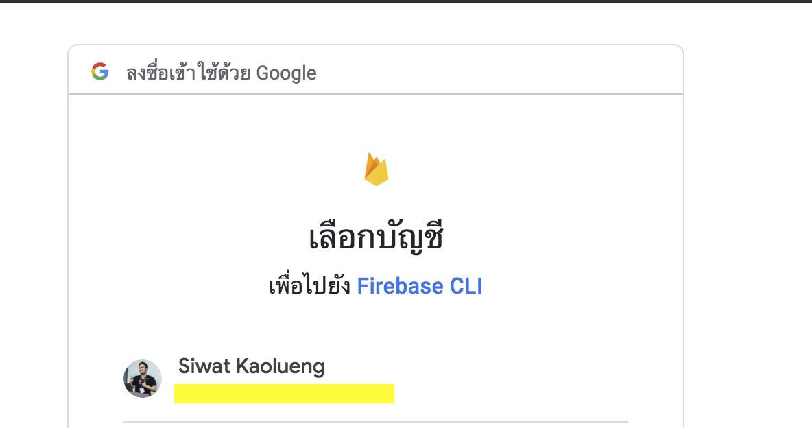

Angular นั้นรัก Firebase อย่างกับพี่น้องเพราะมาจากพ่อแม่เดียวกันนั้นคือ Google 𝗚

เนื้อหาบทความนี้ประกอบไปด้วย

- การ Setup Angular Project, Angular Material และ Firebase

สวัสดีครับผมเจมส์จาก Angular Thailand วันนี้จะมาเล่าวิธีการใช้ Library ตัวหนึ่งที่มีชื่อว่า [AngularFire](https://github.com/angular/angularfire) 🅰️🔥 ซึ่งเป็น Official Library จากทีม Angular ดูแลร่วมกับ Open Source Maintainer ท่านอื่นๆ

เรามาเริ่มกันเลยดีกว่า

ขั้นแรกลง @angular/cli version 9.0.0-rc.0

```
npm install -g @angular/cli@next
```


สร้างโปรเจคด้วย ng new ไม่ใส่ Route เลือก style เป็น scss

```
ng new firebase-ivy-live-feed --routing=false --style=scss
```


ลง Angular​ Material ด้วยคำสั่ง

```bash
ng add @angular/material
```

 โดย schematics จะมี x-prompt ถามเราให้เลือก

- Theme ผมเลือก Custom Theme เพราะ Prebuilt Theme Pallete สีเหลือง
- HammerJS ใช้สำหรับจับ Gesture ซึ่งถูกใช้ในบาง Component เช่น mat-slide-toggle, mat-slider, matToolTip โดยผมตอบ **No** ไม่ได้ใช้
- Import BrowserAnimationModule สำหรับ Angular Animation ซึ่งส่วนใหญ่ใช้ใน Angular Material โดยผมตอบ **No** เช่นกัน

นอกจากนี้ ng add ยังอำนวยความสะดวกให้เราด้วยการ

- เพิ่ม dependency @angular/cdk @angular/material ใน package.json
- ใส่ Font Roboto ให้ใน index.html (display: swap ให้ด้วย)
- ใส่ Material Design Icon ให้ใน index.html
- เพิ่ม global css style ลบ margin จาก body ออก, height: 100% ให้กับ html, body และตั้ง Roboto Font เป็น Default

[ที่มา](https://material.angular.io/guide/getting-started#install-angular-material)

อะไรมันจะสะดวก สบายเยี่ยงนี้ 😎


ต่อไปเป็นการสร้าง Firebase โปรเจค
เข้าเว็บ [https://console.firebase.google.com](https://console.firebase.google.com)


สร้างและตั้งชื่อโปรเจค


เปิด Google Analytics


เลือก Google Analytics Account


ต่อไปลง AngularFire ด้วยคำสั่ง

```bash
ng add @angular/fire
```

ปรากฏว่า error

```bash
HTTP Error: 401, The entered credentials were incorrect.
```


อ๋อผมเคยลง firebase-tools ไว้นานมาแล้วตั้งแต่เวอร์ชั่น 3.9.1 ตอนนี้เวอร์ชั่น และไม่ได้ใช้มานาน Token น่าจะหมดอายุ ผมเลย Logout ด้วยคำสั่ง

```bash
firebase logout
```

แล้วทำการ ng add ใหม่ แล้วพบว่าสามารถทำงานได้ปกติ และมี x-prompt ขึ้นมา

- Firebase ขอเก็บข้อมูลการใช้ CLI ได้ไหม ซึ่งผมไม่ให้ 55
- ให้เลือก Google Account สำหรับการมอบสิทธิให้ Firebase CLI เข้าถึง Project ใน Account นั้นๆ (Google Cloud Project ด้วย)




- หลังจากนั้นเราได้ Authorization Code ให้ Copy ไปใส่ใน CLI


- เลือก Firebase Project ที่เราเพิ่งสร้างขึ้นมา


จากนั้น Schematics ของ @angular/fire จะทำการ

- เพิ่ม Dependency @angular/fire และ firebase ใน package.json
- เพิ่มไฟล์ firebase.json และ .firebaserc เพื่อใช้สำหรับการ Deploy เว็บของเราไปที่ Firebase Hosting
- แก้ไขไฟล์ angular.json โดยการเพิ่ม Target deploy สำหรับ Firebase Hosting เข้าไป

จบไปแล้วสำหรับการ Setup Project 

เรามาลอง deploy project ขึ้น Firebase Hosting ด้วยคำสั่ง

```bash
# ng run ชื่อโปรเจค:deploy หรือ ng deploy
ng run firebase-ivy-live-feed:deploy
```


แล้วก็พบว่า


จบแล้ว เป็นไงกันบ้างสำหรับการอัพเดทครั้งนี้ ฝากแชร์ต่อให้เพื่อนพี่น้อง ชาว Angular ได้อัพเดทกัน 🔗

บทความต่อไปจะเป็นการเขียนโค๊ด Integrate Angular 🅰️, Firebase 🔥, Material Ⓜ️

โปรดติดตามตอนต่อไป 🔜

<a rel="license" href="http://creativecommons.org/licenses/by-nc-sa/4.0/"></a><br />บทความนี้ใช้<a rel="license" href="http://creativecommons.org/licenses/by-nc-sa/4.0/">สัญญาอนุญาตของครีเอทีฟคอมมอนส์แบบ แสดงที่มา-ไม่ใช้เพื่อการค้า-อนุญาตแบบเดียวกัน 4.0 International</a>.
