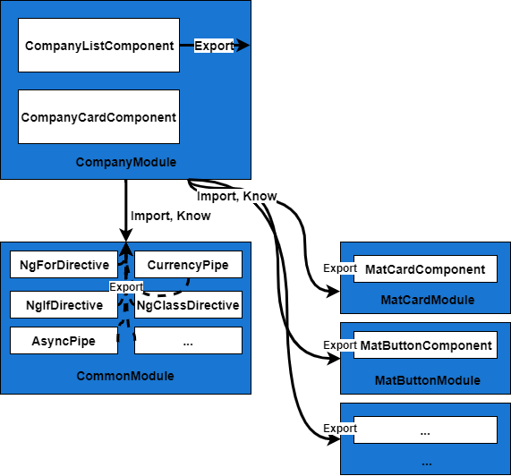
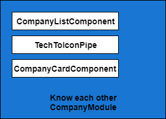

## อะไรคือ NgModule กันนะ

สวัสดีครับขอต้อนรับเข้าสู่ Angular Fundamental Series 📚

ที่มาของบทความนี้เกิดจากผมได้มีโอกาสเข้าไปเขียนโค๊ดกับรุ่นน้องคนหนึ่ง ผมเห็น Error บน Chrome Dev Tools 🛠️ แจ้งประมาณว่า

```typescript
Error: Template parse errors:
'mat-tab' is not a known element:
1. If 'mat-tab' is an Angular component, then verify that it is part of this module.
2. If 'mat-tab' is a Web Component then add 'CUSTOM_ELEMENTS_SCHEMA' to the '@NgModule.schemas' of this component to suppress this message.
```

ผมบอกน้องไปว่า "น้องลืมใส่ import MatTabModule ใน Module ที่น้องกำลังใช้อยู่หรือเปล่า"

น้องคนนั้นก็เปิดไฟล์ Module นั้นแล้วก็พบว่า ... ยังไม่ได้ใส่ MatTabModule เข้าไปที่ "imports" ใน "metadata" ของ **NgModule**

หลังจากน้องทำการแก้ไขตามที่ผมบอก ระบบทำงานได้ตามปกติ

หลังจากนั้นผมเก็บความผิดพลาดนี้ไว้ แล้วจึงไปถามรุ่นพี่ใช้ Angular อยู่เป็นประจำว่า "เอาจริงๆพี่เข้าใจ **NgModule** ไหม"

พี่เขาตอบกลับมาว่า "ทุกวันนี้พี่ยังไม่เข้าใจมันเลยน้องเอ้ย" 😱

จึงเกิดเป็นบทความนี้เพื่ออธิบาย **NgModule** ทั้งภาพกว้างและเชึงลึก

มาเริ่มกันเลยดีกว่า

## NgModule - Unit of Compilation & Distribution

NgModule คือ JavaScript Class ที่ถูกเพิ่มความสามารถด้วย Decorator ที่มีชื่อว่า **@NgModule** โดยที่ **@NgModule** รับ metadata object

```typescript
import { BrowserModule } from '@angular/platform-browser';
import { NgModule } from '@angular/core';
import { AppComponent } from './app.component';

// @NgModule decorator พร้อมด้วย metadata object (declarations, imports, ...)
@NgModule({
  declarations: [AppComponent],
  imports: [BrowserModule],
  providers: [],
  bootstrap: [AppComponent]
})
export class AppModule {}
```

สิ่งสำคัญคือ **NgModule** มีไว้เพื่ออะไร
NgModule ใช้ metadata เพื่อ

1. อธิบายวิธีการ Compile Components, Templates, Directives, Pipes ให้กับ Angular Compiler
2. ระบุ Components, Directives, Pipes ให้เป็นสาธารณะ (Public) ผ่าน metadata ที่มีชื่อว่า **exports** เพื่อให้ Module อื่น ที่ import Module นี้เรียกใช้งานได้
3. เพิ่ม Services หรือ Providers เพื่อใช้ Dependency Injection ใน Component ได้

เรามาดูเคส 1, 2 ผ่านตัวอย่างด้านล่างนี้กันดีกว่า

```typescript
@NgModule({
  imports: [
    CommonModule,
    FlexLayoutModule,
    BrowserAnimationsModule,
    MatCardModule,
    MatButtonModule,
    MatIconModule,
    MatProgressSpinnerModule,
  ],
  declarations: [
    CompanyCardComponent,
    TechToIconPipe,
    CompanyListComponent
  ],
  exports: [
    CompanyListComponent,
  ]
})
export class CompanyModule { }
```

[CompanyModule ฉบับเต็ม](https://github.com/AngularThailand/who-use-angular-in-thailand/blob/master/apps/who-use-angular-in-thailand/src/app/company/company.module.ts)

ในตัวอย่างนี้มี metadata ที่น่าสนใจคือ imports, declarations, exports

แต่จะขอเล่าจาก exports, imports, declarations ตามลำดับ

</br></br>
**exports**

ใช้ระบุ Components, Directives, Pipes เพื่อส่งออกให้เรียกใช้ใน Scope นั้นๆได้

ความหมายคือหาก ModuleA import ModuleB นี้เข้าไป ทุกสิ่งที่ exports ใน ModuleB จะไปอยู่ใน Scope ของการ Compile ModuleA

ทำให้ ModuleA รู้จักและสามารถเรียกใช้สิ่งที่ ModuleB export ได้

ตัวอย่าง **CompanyListComponent** ถูก exports ใน **CompanyModule**

```typescript
@NgModule({
  ...,
  exports: [
    CompanyListComponent,
    // XXXPipe,
    // XXXDirective
  ]
})
export class CompanyModule { }
```

และเมื่อ **AppModule** import **CompanyModule** เข้าไป

```typescript
@NgModule({
  declarations: [
    AppComponent
  ]
  imports: [
    ...,
    CompanyModule,
    ...
  ],
  ...
})
export class AppModule { }
```

[AppModule ฉบับเต็ม](https://github.com/AngularThailand/who-use-angular-in-thailand/blob/master/apps/who-use-angular-in-thailand/src/app/app.module.ts)

**AppComponent** ที่อยู่ใน declarations จึงรู้จักและสามารถเรียกใช้ **CompanyListComponent** ใน Template ได้


ด้านล่างเป็นตัวอย่างของการที่ **AppComponent** Template (app.component.html) เรียกใช้ `<angular-th-company-list></angular-th-company-list>` ซึ่งก็คือ selector ใน **CompanyListComponent**

```html
...
<angular-th-company-list [companies]="companies$ | async" [loaded]="loaded"></angular-th-company-list>
...
```

ซึ่งเรียกใช้ได้ตามปกติเพราะรู้จักแล้ว

[app.component.html ฉบับเต็ม](https://github.com/AngularThailand/who-use-angular-in-thailand/blob/master/apps/who-use-angular-in-thailand/src/app/app.component.html)

</br></br></br>
**imports**

ใช้สำหรับ imports Module อื่นๆ เพื่อใช้สิ่งที่ Module นั้น exports ออกมาไม่ว่าจะเป็น Components, Pipes, Directives ณ Compile-time

รวมถึง Providers ที่ Module นั้น Register ไว้ก็สามารถใช้ได้ ณ Run-time (Dependency Injection)

```typescript
@NgModule({
  imports: [
    CommonModule,
    FlexLayoutModule,
    BrowserAnimationsModule,
    MatCardModule,
    MatButtonModule,
    MatIconModule,
    MatProgressSpinnerModule,
    // XXXModule
  ],
  ...
})
export class CompanyModule { }
```

จากตัวอย่างโค๊ดด้านบน
**CompanyCardComponent** (company-card.component.html) ได้ใช้ `<mat-card></mat-card>`
และ Directive fxLayoutAlign `<div fxLayoutAlign="center center">`

```html
<mat-card fxLayout="column" *ngIf="company">
  ...
  <div fxLayoutAlign="center center" style="height: 300px">
    ...
  </div>
  ...
</mat-card>
```

[company-card.component.html ฉบับเต็ม](https://github.com/AngularThailand/who-use-angular-in-thailand/blob/master/apps/who-use-angular-in-thailand/src/app/company/company-card/company-card.component.html#L1)

การที่จะใช้สิ่งเหล่านี้ เราต้องบอก Angular Compiler ว่าเราใช้ **MatCardComponent**, **FxLayoutAlignDirective**
ซึ่งใน **MatCardModule**, **FxLayoutModule** ได้ exports ไว้แล้ว
ดังนั้นเราแค่ import **MatCardModule** และ **FlexLayoutModule** ก็สามารถใช้ได้

ทุกท่านอาจจะสงสัยว่า **CommonModule** มีไว้ทำอะไร
**CommonModule** นั้นมีความสำคัญมาก
**CommonModule** ทำให้เราสามารถใช้ `*ngIf, *ngFor, [ngClass], AsyncPipe (| async), CurrencyPipe (| currency)` และอื่นๆ เพราะตัวมันเอง exports สิ่งเหล่านี้ให้เราใช้

[อ่าน CommonModule เพิ่มเติม](https://angular.io/api/common/CommonModule)

Components อื่นๆเช่น **MatButton, BrowserAnimationsModule, MatIcon, MatProgressBar** ใช้หลักการเหมือนกับข้างบน

**FormsModule, ReactiveFormsModule** ถ้าจะใช้ต้อง import เข้ามาเช่นกัน


</br></br></br>
**declarations**

ระบุ Component, Directive, Pipe ทั้งหมดเพื่อบอก Angular Compiler ว่าใช้ในการ Compile **เฉพาะใน Scope ของ Module นี้เท่านั้น**

```typescript
@NgModule({
  ...
  declarations: [
    CompanyCardComponent,
    TechToIconPipe,
    CompanyListComponent,
    // XXXDirective
  ],
  ...
})
export class CompanyModule { }
```

จากตัวอย่างโค๊ดด้านบน สิ่งที่มันอธิบายคือ
Component (**CompanyCardComponent, CompanyListComponent**) และ Pipes (**TechToIconPipe**) รู้จักกันสามารถเรียกใช้งานระหว่างกันได้
**CompanyCardComponent** เรียกใช้ **TechToIconPipe** ใน Template

```html
...

...
```

[company-card.component.html ฉบับเต็ม](https://github.com/AngularThailand/who-use-angular-in-thailand/blob/master/apps/who-use-angular-in-thailand/src/app/company/company-card/company-card.component.html#L24)

**CompanyListComponent** วนลูปสร้าง `<company-card></company-card>` ด้วย `*ngFor` ใน Template

```html
...
<angular-th-company-card *ngFor="let company of companies" [company]="company"></angular-th-company-card>
...
```

[company-list.component.html ฉบับเต็ม](https://github.com/AngularThailand/who-use-angular-in-thailand/blob/master/apps/who-use-angular-in-thailand/src/app/company/company-list/company-list.component.html#L3)



</br></br></br>
**providers**

หลังจาก Angular Version 6.0 เราสามารถ Singleton Service ด้วยการใส่ `providedIn: 'root'` ใน metadata ของ `@Injectable()` เพื่อบอก Angular ให้ Register Service นี้ที่ Application Root ซึ่งวิธีนี้ทำให้ Compiler สามารถ Tree-shaking Services ที่ไม่ได้ใช้ออก

```typescript
@Injectable({
  providedIn: 'root'
})
export class CompanyService {

  constructor(private http: HttpClient) { }
  getCompanies() {
    return this.http.get<Company[]>('/assets/data/companies.json').pipe(
      shareReplay(1));
  }
}
```

แต่ก่อนหน้านั้น 6.0 ต้อง register ที่ระดับ Module (หรือ Component Level) ใน providers

```typescript
@NgModule({
  ...
  providers: [
    CompanyService,
    // {
    //   provide: HTTP_INTERCEPTORS, useClass: HttpInterceptorService, multi: true
    // },
  ],
  ...
})
```

**forRoot, forChild, forFeature, forXXX, xxx คือ ModulewithProviders**

ทุกท่านอาจจะเคยเห็น forRoot, forChild, forFeature และอื่นๆ มันคืออะไรกันนะ? 🤔

```typescript
@NgModule({
  imports: [RouterModule.forRoot(...)],
  exports: [RouterModule]
})
export class AppRoutingModule {}

@NgModule({
  imports: [RouterModule.forChild(...)],
  exports: [RouterModule]
})
export class CompanyRoutingModule { }

@NgModule({
  imports: [
    StoreModule.forFeature(...),
    TranslateModule.forChild(...),
    EffectsModule.forFeature(...)
  ],
})
export class ExamplesModule { }

@NgModule({
  imports: [
    AngularFireModule.initializeApp(...),
    StoreModule.forRoot(...),
    StoreRouterConnectingModule.forRoot(),
    EffectsModule.forRoot(...),
    StoreDevtoolsModule.instrument(...),
    TranslateModule.forRoot(...)
  ],
})
export class AppModule { }
```

ดูแล้วมันเหมือนเอาไว้ Configure อะไรบางอย่างถูกต้องไหมครับ เรามาดูตัวอย่างจาก AngularFireModule ดีกว่า

```typescript
@NgModule({
  imports: [
    AngularFireModule.initializeApp({
      apiKey: 'perjerzKey',
      authDomain: 'perjerz.app',
      projectId: 'perjerzId',
      databaseURL: 'https://perjerz.firebaseio.com',
      storageBucket: 'perjerz.appspot.com',
      messagingSenderId: '1212312121',
      appId: '1150',
    }),
    ...
  ],
})
export class AppModule { }
```

ถูกต้องแล้วครับ ✅ มันใช้สำหรับ Configure Value ใน Token, Service เพื่อตอนที่เราจะใช้ Dependency Injection ใน Component จะได้ค่านั้นไปใช้
ตัวอย่างเช่นการ Setup AngularFire จะทำให้ Angular App คุยกับ Firebase 🔥 เราจึงต้องจำเป็นระบุ Config

ด้านล่างเป็น Code AngularFireModule จาก @angular/fire จะเห็นได้ว่ามันรับค่าผ่าน parameters แล้วเอาไป config ให้กับ providers - FirebaseOptionsToken และ FirebaseNameOrConfigToken ไปใช้

```typescript
const FirebaseAppProvider = {
    provide: FirebaseApp,
    useFactory: _firebaseAppFactory,
    deps: [
        FirebaseOptionsToken,
        [new Optional(), FirebaseNameOrConfigToken]
    ]
};

@NgModule({
    providers: [ FirebaseAppProvider ],
})
export class AngularFireModule {
    static initializeApp(options: FirebaseOptions, nameOrConfig?: string | FirebaseAppConfig) {
        return {
            ngModule: AngularFireModule,
            providers: [
                { provide: FirebaseOptionsToken, useValue: options },
                { provide: FirebaseNameOrConfigToken, useValue: nameOrConfig }
            ]
        }
    }
}
```

[AngularFireModule ฉบับเต็ม](https://github.com/angular/angularfire2/blob/master/src/core/firebase.app.module.ts#L58)\

แล้วเมื่อเราจะใช้ Service ของ Firebase เช่น AngularFireDatabase, AngularFireAuth เราจึงสามารถใช้มันได้เลยโดยไม่ต้องมาส่งค่า apiKey, authDomain, databaseURL ซ้ำอีกรอบเพราะมันจะไป Resolve Value จาก Token ที่ Configure (Register) ไว้ที่ Module แล้ว

```typescript
@Injectable()
export class AppGuard implements CanActivate {
  constructor(
    private db: AngularFireDatabase,
    private auth: AngularFireAuth,
    private router: Router,
  ) { }
   canActivate(): Observable<boolean | UrlTree> {
    return this.auth.authState.pipe(switchMap(user => {
        return this.db.object(`...`).valueChanges().pipe(...)
      }
   }
}
```

จะเห็นได้ว่าคนใหม่เข้าโปรเจค ก็สามารถมาอ่าน Configure ที่ระบุไว้ตรง Module ได้เลย

[อ่านเรื่อง Dependency Injection ได้ที่ DevNote](https://medium.com/devnote/%E0%B8%97%E0%B8%B3%E0%B8%84%E0%B8%A7%E0%B8%B2%E0%B8%A1%E0%B8%A3%E0%B8%B9%E0%B9%89%E0%B8%88%E0%B8%B1%E0%B8%81%E0%B8%81%E0%B8%B1%E0%B8%9A-dependency-injection-%E0%B9%83%E0%B8%99-angular-880cbf483239)

</br></br></br>
**entryComponents**

ไว้ระบุ Component ที่จะต้อง Compile บอก Angular Compiler ว่าเราจะใช้ Component เหล่านี้แน่ๆ สร้าง Component Factory ทำ Dynamic Load ณ Run-time (Imperatively) ไม่ต้อง Tree Shake ลบ Component นี้ออกไป

โดยปกติแล้ว Component ที่เราใช้ใน Template `<company-card></company-card>` Compiler มันรู้ได้เลยจากการใช้ (Reference) จึงสามารถ Inline Instantiation ได้เลย (Statically, Declaratively)

แต่กลับกันในกรณีการทำ [Dynamic Component Loader](https://angular.io/guide/dynamic-component-loader) (Load Component ตอน Runtime) ซึ่งต้องใช้ entryComponents

ตัวอย่างที่ชัดเจนเลยคือ [MatDialog](https://material.angular.io/components/dialog/overview#configuring-dialog-content-via-code-entrycomponents-code-) (Material Dialog) ที่เราต้องระบุ Component ที่เราสร้างไว้สำหรับเปิด Dialog ขึ้นมา

```typescript
@NgModule({
  imports: [
    // ...
    MatDialogModule
  ],

  declarations: [
    AppComponent,
    ExampleDialogComponent
  ],

  entryComponents: [
    ExampleDialogComponent // ต้องระบุว่า Component นี้เข้าไป
  ],

  providers: [],
  bootstrap: [AppComponent]
})
export class AppModule {}
```

อีกกรณีหนึ่งคือการ Load Component ใน Routes (RouterModule) นั้นใช้ Component Factory เหมือนกันเพราะมัน Dynamic Load ณ Runtime เพียงแต่ว่าเราไม่ต้องระบุ Component ใน entryComponents เองเพราะ RouterModule แอบเพิ่มให้เองตอน Compile

```typescript
const routes: Routes = [
  {
    path: 'a',
    component: ComponentA
  },
  {
    path: 'b',
    component: ComponentB
  }
];

@NgModule({
  imports: [
    RouterModule.forRoot(routes)
  ],
  exports: [RouterModule],
})
export class AppRoutingModule {}
```

มีอีกเรื่องหนึ่งที่น่าสนใจคือการที่ เราประกาศ Declarations และ Exports ComponentA, ComponentB, ComponentC ที่ ModuleA แล้วเรา Import ModuleA ใน AppModule แต่ปรากฏว่าใน Template เราไม่ได้มีการใช้ (Reference) สิ่งเหล่านั้น Angular Compiler จะถือว่าเราไม่ได้ใช้ จึงไม่รวมเข้าไปใน Bundle เพื่อทำให้มันเล็กลง ยกตัวอย่างเช่นกรณีของ Custom MatModule (Material Design Module) ที่ declarations และ exports ทุกอย่าง ถึงเราจะ import MatButtonModule, MatCardModule เข้าแต่เราไม่ได้ใช้ ใน Template ก็ไม่ต้องจ่าย Cost ของขนาด Bundle ที่ใหญ่ขึ้น

```typescript
@NgModule({
  imports: [
    MatToolbarModule,
    MatMenuModule,
    ...
  ],
  exports: [
    MatToolbarModule,
    MatMenuModule,
    ...
  ], // ถึงแม้จะ export ออกไป ถ้าไม่ได้ใช้ก็ไม่ต้องจ่าย Bundle Size
  declarations: []
})
export class CustomMatModule { }
```

</br></br></br>
**bootstrap**

ระบุ Component ที่เอาไว้สร้างตอนเริ่มรัน App (Bootstrap) โดยปกติคือ Root Component ซึ่งก็คือ AppComponent
Bootstrap Component นั้นจะถูกเพิ่มเข้าไปใน entryComponents โดยอัตโนมัติ

ตัวอย่างที่ชัดเจนเลยคือ AppModule

```typescript
@NgModule({
  declarations: [AppComponent],
  imports: [BrowserModule],
  providers: [],
  bootstrap: [AppComponent]
})
export class AppModule {}
```

</br></br></br>
**schemas**

ระบุ Schema ที่อนุญาตให้ใช้ใน Scope ของ NgModule โดยมีสองค่าที่ใช้ได้คือ [NO_ERRORS_SCHEMA](https://github.com/angular/angular/blob/master/packages/core/src/metadata/schema.ts#L38) และ [CUSTOM_ELEMENTS_SCHEMA](https://github.com/angular/angular/blob/master/packages/core/src/metadata/schema.ts#L29)

**NO_ERRORS_SCHEMA - บอก Angular Compiler ว่าอนุญาตทุก Element ทุก Property เป็นอะไรก็ได้**

สำหรับการทำ [Shallow Testing](https://vsavkin.com/three-ways-to-test-angular-2-components-dcea8e90bd8d) เราต้องการจะ Test Angular Template โดยละ Dependencies ไว้ในฐานที่เข้าใจ ของ Component (ไม่ต้องสนใจ Template Error ว่า Require อะไร)
เราสามารถ Configure Module เพื่อบอก Angular Component บางตัวที่เราสร้างให้คิดซะว่าเป็นแค่ DOM ธรรมดา

ตัวอย่างด้านล่างคือมี Component ชื่อ ConversationsCmp ที่เราต้องการเทสว่า มัน Render ข้อความข้างในถูกต้องซึ่งใน template นั้นใช้ `<mat-card></mat-card>` หรือ MatCardComponent  ซึ่งเราไม่ได้สนใจหน้าตาความสวยงามของมัน เราต้องการเช็คว่ามีข้อความข้างในและถูกต้องไหม

ตอนสร้าง TestBed เลย Configure Module โดยใส่ schemas `NO_ERRORS_SCHEMA` ไม่ต้องฟ้อง Error จากการไม่ import `MatCardModule` ให้ Angular Compiler เข้าใจ Scope ของ `MatCardComponent` ด้วย แล้วก็รันเทสตามปกติ

```html
<mat-card *ngFor="let c of conversations | async" [routerLink]="[c.id]">
  <h3>
    <a [routerLink]="[c.id]">{{c.title}}</a>
  </h3>
  <p>
    <span class="light">{{c.user.name}} [{{c.user.email}}]</span>
  </p>
</mat-card>
```

```typescript
@Component({templateUrl: 'conversations.html'})
export class ConversationsCmp {
  folder: Observable<string>;
  conversations: Observable<Conversation[]>;

  constructor(route: ActivatedRoute) {
    this.folder = route.params.pluck<string>('folder');
    this.conversations = route.data.pluck<Conversation[]>('conversations');
  }
}
```

```typescript
describe('ConversationsCmp', () => {
  let params: BehaviorSubject<string>;
  let data: BehaviorSubject<any>;

  beforeEach(async(() => {
    params = of({
      folder: 'inbox'
    });

    data = of({
      conversations: [
        { id: 1, title: 'On the Genealogy of Morals by Nietzsche', user: {name: 'Kate', email: 'katez@example.com'} },
        { id: 2, title: 'Ethics by Spinoza', user: {name: 'Corin', email: 'corin@example.com'} }
      ]
    });

    TestBed.configureTestingModule({
      declarations: [ConversationsCmp],
      providers: [
        { provide: ActivatedRoute, useValue: {params, data} }
      ],
      // Tells the compiler not to error on unknown elements and attributes
      schemas: [NO_ERRORS_SCHEMA]
    });
    TestBed.compileComponents();
  }));

  it('updates the list of conversations', () => {
    const f = TestBed.createComponent(ConversationsCmp);
    f.detectChanges();

    expect(f.debugElement.nativeElement).toHaveText('inbox');
    expect(f.debugElement.nativeElement).toHaveText('On the Genealogy of Morals');
    expect(f.debugElement.nativeElement).toHaveText('Ethics');

    params.next({
      folder: 'drafts'
    });

    data.next({
      conversations: [
        { id: 3, title: 'Fear and Trembling by Kierkegaard', user: {name: 'Someone Else', email: 'someonelse@example.com'} }
      ]
    });
    f.detectChanges();

    expect(f.debugElement.nativeElement).toHaveText('drafts');
    expect(f.debugElement.nativeElement).toHaveText('Fear and Trembling');
  });
});
```

**CUSTOM_ELEMENTS_SCHEMA - บอก Angular Compiler ว่าอนุญาต Non-Angular Elements และ Properties ด้วย Dash case ซึ่ง Dash Case เป็น Convention ของ Custom Elements**

โดยปกติแล้ว Angular จะเข้าใจว่า Custom HTML Tag เป็น Angular Component หมดเวลาเจออะไรแปลกๆไม่รู้จักใน Scope ก็เด้ง error ในกรณีที่เราต้องการใช้ Custom Element เลยต้องบอกว่า Angular Compiler เราจะใช้ Custom Element นะไม่ต้องงง จากนั้นมันจะ Compile ผ่าน

```typescript
import { BrowserModule } from '@angular/platform-browser';
import { NgModule, CUSTOM_ELEMENTS_SCHEMA } from '@angular/core';
import { ReactiveFormsModule } from '@angular/forms';

import { AppComponent } from './app.component';

@NgModule({
  declarations: [AppComponent],
  schemas: [CUSTOM_ELEMENTS_SCHEMA] // <-- บอกตรงนี้,
  imports: [BrowserModule, ReactiveFormsModule],
  providers: [],
  bootstrap: [AppComponent]
})
export class AppModule {}
```

[ศึกษาเรื่อง Custom Element ใน Angular ต่อ](https://vaadin.com/tutorials/using-web-components-in-angular)

## สรุป NgModule

1. อธิบายวิธีการ Compile Components, Templates, Directives, Pipes ให้กับ Angular Compiler
2. ระบุ Components, Directives, Pipes ให้เป็นสาธารณะ (Public) ผ่าน metadata ที่มีชื่อว่า **exports** เพื่อให้ Module อื่น ที่ import Module นี้เรียกใช้งานได้
3. เพิ่ม Services หรือ Providers เพื่อใช้ Dependency Injection ใน Component ได้

ก่อนจบบทความนี้ไป ผมมีปริศนาฟ้าแลบ ⚡ ให้ทุกท่านทาย คำถามมีอยู่ว่า

ตอนนี้ Angular App 🅰️ ของเราได้ทำการแบ่ง Feature Module ไว้เรียบร้อยแล้ว

CEO 😎 ต้องการให้ Angular App ทำให้ช่องกรอกเบอร์โทรศัพท์ 📞 mask เบอร์จาก 0999999999 เป็น 099-999-999 **เหมือนกันทุกช่อง input ใน App**

พวกเราเหล่า Developers 👨💻 จึง Search หา Library ใน Google แล้วพบตัวนึงที่มีชื่อว่า [ngx-mask](https://github.com/JsDaddy/ngx-mask)

โอเคเรา `npm install --save ngx-mask` เรียบร้อย

ใน ngx-mask github ได้แนะนำวิธีการ import Module ไว้ด้านล่าง

```typescript
import { NgxMaskModule } from 'ngx-mask'

export const options: Partial<IConfig> | (() => Partial<IConfig>);

@NgModule({
  (...)
  imports: [
    NgxMaskModule.forRoot(options)
  ]
  (...)
})
```

คำถามคือเราจะต้อง `import NgxMaskModule` ยังไงและที่ไหนบ้าง?

1. import NgxMaskModule.forRoot(options) ที่ AppModule ที่เดียวจบใช้ได้ทั้ง App
2. import NgxMaskModule.forRoot(options) ที่ AppModule และ ทุก Feature Module ที่เราแบ่งไว้
3. import NgxMaskModule.forRoot(options) ที่ AppModule และ import NgxMaskModule ทุก Feature Module
4. import NgxMaskModule ที่ AppModule และ ทุก Featured Module
5. import NgxMaskModule ที่ AppModule และ import NgxMaskModule.forRoot(options) ทุก Feature Module
6. import NgxMaskModule ที่ AppModule ที่เดียวจบใช้ได้ทั้ง App

แล้วถึงสามารถใช้โค๊ดด้านล่างได้

```html
<input type="text" mask="000-000-000">
```

```html
<span>{{phone | mask: '000-000-0000'}}</span>
```

แล้วจะมาเฉลยในบทความต่อไปของ NgModule

จบไปแล้วสำหรับ NgModule เบื้องต้น ยังมีอีกหลายเรื่องใน NgModule ที่คุยกันต่อได้เช่น

- ลำดับการสร้างตอน Bootstrap App ของ NgModule
- Feature Module คืออะไรกันนะ? 🤔
- ประเภทของ Feature Module
- Lazy-Loading Module คืออะไรกัน? 🤔
- NgModule พื้นฐานเช่น RouterModule, HttpClientModule, FormsModule

ฝากแชร์ 🔗 ต่อให้เพื่อนพี่น้อง ชาว Angular ได้อัพเดทกัน

แล้วเจอกันบทความหน้า 👋 สวัสดีครับ 🙏

<a rel="license" href="http://creativecommons.org/licenses/by-nc-sa/4.0/"></a><br />บทความนี้ใช้<a rel="license" href="http://creativecommons.org/licenses/by-nc-sa/4.0/">สัญญาอนุญาตของครีเอทีฟคอมมอนส์แบบ แสดงที่มา-ไม่ใช้เพื่อการค้า-อนุญาตแบบเดียวกัน 4.0 International</a>.
