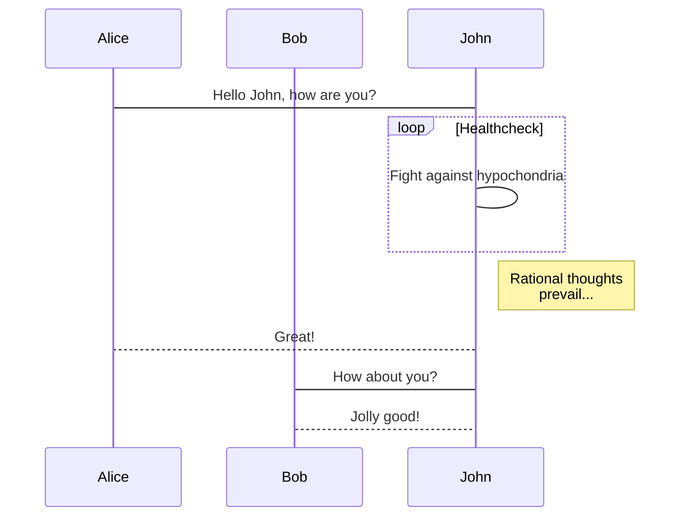
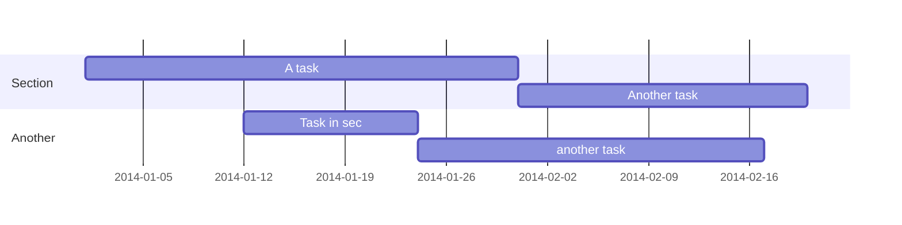

# อะไรคือ NgModule กันนะ?

สวัสดีครับขอต้อนรับเข้าสู่ Angular Fundamental Series โดย PerJerZ

ที่มาของบทความนี้เกิดจากผมได้มีโอกาสเข้าไปเขียนโค๊ดกับรุ่นน้องคนหนึ่ง ผมเห็น Error บน Chrome Dev Tools แจ้งประมาณว่า

```typescript
Error: Template parse errors:
'mat-tab' is not a known element:
1. If 'mat-tab' is an Angular component, then verify that it is part of this module.
2. If 'mat-tab' is a Web Component then add 'CUSTOM_ELEMENTS_SCHEMA' to the '@NgModule.schemas' of this component to suppress this message.
```

ผมบอกน้องไปว่า "น้องลืมใส่ import MatTabModule ใน Module ที่น้องกำลังใช้อยู่หรือเปล่า"

น้องคนนั้นก็เปิดไฟล์ Module นั้นแล้วก็พบว่า ... ยังไม่ได้ใส่ MatTabModule เข้าไปที่ "imports" ใน "metadata" ของ **NgModule**

หลังจากน้องทำการแก้ไขตามที่ผมบอก ระบบทำงานได้ตามปกติ

หลังจากนั้นผมเก็บความผิดพลาดนี้ไว้ แล้วจึงไปถามรุ่นพี่ใช้ Angular อยู่เป็นประจำว่า "เอาจริงๆพี่เข้าใจ **NgModule** ไหม"

พี่เขาตอบกลับมาว่า "ทุกวันนี้พี่ยังไม่เข้าใจมันเลยน้องเอ้ย"

จึงเกิดเป็นบทความนี้เพื่ออธิบาย **NgModule** ทั้งภาพกว้างและเชึงลึก

มาเริ่มกันเลยดีกว่า

## NgModule - Unit of Compilation & Distribution

NgModules คือ JavaScript Class ที่ถูกเพิ่มความสามารถด้วย Decorator ที่มีชื่อว่า **@NgModule** โดยที่ **@NgModule** รับ metadata object

```typescript
import { BrowserModule } from '@angular/platform-browser';
import { NgModule } from '@angular/core';
import { AppComponent } from './app.component';

// @NgModule decorator พร้อมด้วย metadata object (declarations, imports, ...)
@NgModule({
  declarations: [AppComponent],
  imports: [BrowserModule],
  providers: [],
  bootstrap: [AppComponent]
})
export class AppModule {}
```
<!-- **ผมเรียกพวกนี้ว่าพิธีกรรมซึ่งมีเหตุผลข้อดีข้อเสียของมัน แต่ละ Frameworks และ Libraries มีพิธีกรรมไม่เหมือนกัน** -->

สิ่งสำคัญคือ **NgModule** มีไว้เพื่ออะไร
NgModule ใช้ metadata

1. อธิบายวิธีการ Compile Components, Templates, Directives, Pipes ให้กับ Angular Compiler
2. ระบุ Components, Directives, Pipes ให้เป็นสาธารณะ (Public) ที่เมื่อ Import Module นี้ไปแล้วสามารถใช้งานได้ผ่าน metadata ที่มีชื่อว่า **exports**
3. เพิ่ม Services หรือ Providers เพื่อใช้ Dependency Injection ใน Component ได้

เรามาดูเคส 1, 2 ผ่านตัวอย่างด้านล่างนี้กันดีกว่า

```typescript
import { FlexLayoutModule } from '@angular/flex-layout';
import { BrowserAnimationsModule } from '@angular/platform-browser/animations';
import { MatButtonModule } from '@angular/material/button';
import { MatCardModule } from '@angular/material/card';
import { MatIconModule } from '@angular/material/icon';
import { MatProgressSpinnerModule } from '@angular/material/progress-spinner';
import { CompanyListComponent } from './company-list/company-list.component';
import { TechToIconPipe } from './company-card/tech-to-icon.pipe';
import { CompanyCardComponent } from './company-card/company-card.component';
import { NgModule } from '@angular/core';
import { CommonModule } from '@angular/common';

@NgModule({
  imports: [
    CommonModule,
    FlexLayoutModule,
    BrowserAnimationsModule,
    MatCardModule,
    MatButtonModule,
    MatIconModule,
    MatProgressSpinnerModule,
  ],
  declarations: [
    CompanyCardComponent,
    TechToIconPipe,
    CompanyListComponent
  ],
  exports: [
    CompanyListComponent,
    CompanyCardComponent,
  ]
})
export class CompanyModule { }
```

ในตัวอย่างนี้มี metadata ที่น่าสนใจคือ imports, declarations , exports

## declarations

ระบุ Component, Directive, Pipe ทั้งหมดเพื่อบอก Angular Compiler ว่าใช้ในการ Compile นะ

## imports

ใช้สำหรับ imports Module อื่นๆที่เราต้องใช้ใน Component ที่เรา declarations ไว้

จากตัวอย่างด้านบน ใน **CompanyCardComponent** ได้ใช้ `<mat-card></mat-card>`
และ Directive fxLayoutAlign `<div fxLayoutAlign="center center" style="height: 300px">`

การที่จะใช้สิ่งเหล่านี้ เราต้องบอก Angular Compiler ว่าเราใช้ **MatCardComponent**, **FxLayoutAlignDirective**

โดยที่ **FlexLayoutModule, MatCardModule** ใส่ metadata exports สองอย่างข้างบนไว้

```ts
@NgModule({
  imports: [
    FlexLayoutModule,
    MatCardModule,
    ...
  ],
  ...
})
export class CompanyModule { }
```

## exports

## Ivy Spec
## Examples of Declarations, Imports, Exports, Schemas, Providers, Bootstrap
## forRoot, forFeature, Module with Provider
## NgModules Constructor Order
## CommonModule, BrowserModule, RouterModule, SharedModule
## Angular ในยุคที่ไม่มี NgModules


**Highlight your code snippets, take notes on math classes, and draw diagrams from textual representation.**

On this page, you'll find some examples of the types of technical content that can be rendered with Academic.

## Examples

### Code

Academic supports a Markdown extension for highlighting code syntax. You can enable this feature by toggling the `highlight` option in your `config/_default/params.toml` file.

    ```python
    import pandas as pd
    data = pd.read_csv("data.csv")
    data.head()
    ```

renders as

```python
import pandas as pd
data = pd.read_csv("data.csv")
data.head()
```

### Math

Academic supports a Markdown extension for $\LaTeX$ math. You can enable this feature by toggling the `math` option in your `config/_default/params.toml` file and adding `markup: mmark` to your page front matter.

To render *inline* or *block* math, wrap your LaTeX math with `$$...$$`.

Example **math block**:

```tex
$$\gamma_{n} = \frac{ 
\left | \left (\mathbf x_{n} - \mathbf x_{n-1} \right )^T 
\left [\nabla F (\mathbf x_{n}) - \nabla F (\mathbf x_{n-1}) \right ] \right |}
{\left \|\nabla F(\mathbf{x}_{n}) - \nabla F(\mathbf{x}_{n-1}) \right \|^2}$$
```

renders as

$$\gamma_{n} = \frac{ \left | \left (\mathbf x_{n} - \mathbf x_{n-1} \right )^T \left [\nabla F (\mathbf x_{n}) - \nabla F (\mathbf x_{n-1}) \right ] \right |}{\left \|\nabla F(\mathbf{x}_{n}) - \nabla F(\mathbf{x}_{n-1}) \right \|^2}$$

Example **inline math** `$$\left \|\nabla F(\mathbf{x}_{n}) - \nabla F(\mathbf{x}_{n-1}) \right \|^2$$` renders as $$\left \|\nabla F(\mathbf{x}_{n}) - \nabla F(\mathbf{x}_{n-1}) \right \|^2$$ .

Example **multi-line math** using the `\\` math linebreak:

```tex
$$f(k;p_0^*) = \begin{cases} p_0^* & \text{if }k=1, \\
1-p_0^* & \text {if }k=0.\end{cases}$$
```

renders as

$$f(k;p_0^*) = \begin{cases} p_0^* & \text{if }k=1, \\
1-p_0^* & \text {if }k=0.\end{cases}$$

### Diagrams

Academic supports a Markdown extension for diagrams. You can enable this feature by toggling the `diagram` option in your `config/_default/params.toml` file or by adding `diagram: true` to your page front matter.

An example **flowchart**:

    ```mermaid
    graph TD;
      A-->B;
      A-->C;
      B-->D;
      C-->D;
    ```

renders as


An example **sequence diagram**:

    ```mermaid
    sequenceDiagram
      participant Alice
      participant Bob
      Alice->John: Hello John, how are you?
      loop Healthcheck
          John->John: Fight against hypochondria
      end
      Note right of John: Rational thoughts <br/>prevail...
      John-->Alice: Great!
      John->Bob: How about you?
      Bob-->John: Jolly good!
    ```

renders as



An example **Gantt diagram**:

    ```mermaid
    gantt
      dateFormat  YYYY-MM-DD
      section Section
      A task           :a1, 2014-01-01, 30d
      Another task     :after a1  , 20d
      section Another
      Task in sec      :2014-01-12  , 12d
      another task      : 24d
    ```

renders as



### Todo lists

You can even write your todo lists in Academic too:

```markdown
- [x] Write math example
- [x] Write diagram example
- [ ] Do something else
```

renders as

- [x] Write math example
- [x] Write diagram example
- [ ] Do something else

### Tables

Represent your data in tables:

```markdown
| First Header  | Second Header |
| ------------- | ------------- |
| Content Cell  | Content Cell  |
| Content Cell  | Content Cell  |
```

renders as

| First Header  | Second Header |
| ------------- | ------------- |
| Content Cell  | Content Cell  |
| Content Cell  | Content Cell  |

### Asides

Academic supports a Markdown extension for asides, also referred to as *notices* or *hints*. By prefixing a paragraph with `A>`, it will render as an aside. You can enable this feature by adding `markup: mmark` to your page front matter, or alternatively using the [*Alert* shortcode](https://sourcethemes.com/academic/docs/writing-markdown-latex/#alerts).

```markdown
A> A Markdown aside is useful for displaying notices, hints, or definitions to your readers.
```

renders as

A> A Markdown aside is useful for displaying notices, hints, or definitions to your readers.

### Did you find this page helpful? Consider sharing it 🙌
